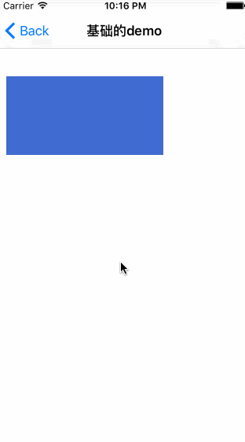
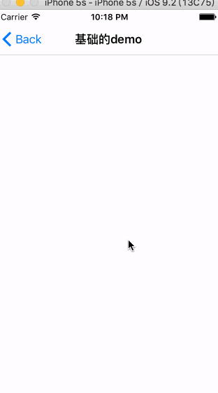

## 动画： 从`旧值`到`新值`的一个缓慢的变化过程

当你改变CALayer的一个属性的值时，它并不能立刻在屏幕上体现出来。相反，它是从`先前的值`平滑过渡到`新的值`。这一切都是默认的行为，你不需要做额外的操作。

而这个缓慢的、自动的变化过程形成了动画，这就是所谓的`隐式动画`。

## 随机改变图层颜色的代码

```objc
@interface BasicViewController ()  {
    UIView *view1;
    CALayer *layer1;
}
@end

@implementation BasicViewController

- (void)viewDidLoad {
    [super viewDidLoad];
   
    view1 = [[UIView alloc] initWithFrame:CGRectMake(10, 100, 200, 100)];
    [self.view addSubview:view1];

    layer1 = [CALayer layer];
    layer1.frame = view1.bounds;
    layer1.backgroundColor = [UIColor blueColor].CGColor;
    [view1.layer addSublayer:layer1];
}

- (void)touchesBegan:(NSSet<UITouch *> *)touches withEvent:(UIEvent *)event {
    
    //1. 即使不写，系统也会默认开始一个Transaction，只不过默认的动画时间只有0.25秒
    [CATransaction begin];
    [CATransaction setAnimationDuration:1.0];
    
    //2. random color
    CGFloat red = arc4random() / (CGFloat)INT_MAX;
    CGFloat green = arc4random() / (CGFloat)INT_MAX;
    CGFloat blue = arc4random() / (CGFloat)INT_MAX;
    
    //3. 修改UIView内部的CALayer的属性值
    //view1.layer.backgroundColor = [UIColor colorWithRed:red green:green blue:blue alpha:1.0].CGColor;
    
    //4. 修改一个单独的CALayer的属性值
    layer1.backgroundColor = [UIColor colorWithRed:red green:green blue:blue alpha:1.0].CGColor;
    
    //5.
    [CATransaction commit];
}

@end
```

运行效果如下:



我们仅仅改变了CALayer的一个属性，就会自带颜色渐变的一个动画。

## 事务: 就像将多个sql语句放在一起执行，CoreAnimation也是有事务的概念的

### CoreAnimation的事务（`CATransaction`）:

- (1) 包含一系列属性动画操作的集合
- (2) 其中被包含的某一个动画操作，并不会立刻让layer发生变化
- (3) 而是当事务被`提交`的时候，开始一个接一个的执行所有的动画


### CoreAnimation事务模板代码:

```objc
//1.
[CATransaction begin];
    
//2. 各种动画操作
//...................
    
//3.
[CATransaction commit];
```

eg、

```objc
//1. begin a new transaction
[CATransaction begin];

//2. set the animation duration to 1 second
[CATransaction setAnimationDuration:1.0];

//3. randomize the layer background color
CGFloat red = arc4random() / (CGFloat)INT_MAX;
CGFloat green = arc4random() / (CGFloat)INT_MAX;
CGFloat blue = arc4random() / (CGFloat)INT_MAX;

//4.
self.colorLayer.backgroundColor = [UIColor colorWithRed:red green:green blue:blue alpha:1.0].CGColor;

//5. commit the transaction
[CATransaction commit];
```

CATransaction这个类设计的很奇怪，CATransaction没有属性或者实例方法，并且也不能用`+alloc`和`-init`方法创建它。


> Core Animation在`每个runloop周期`中`自动开始一次新`的事务（run loop是iOS负责收集用户输入，处理定时器或者网络事件并且重新绘制屏幕的东西），即使你不显式的用[CATransaction begin]开始一次事务，任何在一次run loop循环中属性的改变都会被集中起来，然后做一次`0.25秒`的动画。

类似YYAsyncLayer中的重绘过程:

- (1) 每一次的重绘操作（改变CALayer的某一个属性值），会被打包为一个Transaction

- (2) `-[Transaction commit]`会将当前`Transaction对象`，临时保存到一个缓存容器

- (3) 等待 `Main Thread RunLoop` 处于 `即将休息、即将退出`时，就将缓存容器中保存的所有的`Transaction对象`，提交到 `Main Thread RunLoop`，接受完提交后，`Main Thread RunLoop`进入休眠或退出

- (4) 当 `Main Thread RunLoop` 被唤醒开始新的一轮工作时，就会将之前提交的所有的`Transaction对象`挨个进行发送消息执行

## 上面是直接对一个单独的CALayer修改值后触发的隐式动画，那么对UIView内部的layer进行值修改了？

试着直接对UIView内部的CALayer对象，而不是一个单独的CALayer修改属性值，看是否仍然会出现动画？

```objc
@interface BasicViewController ()  {
    UIView *view1;
    CALayer *layer1;
}
@end

@implementation BasicViewController

- (void)viewDidLoad {
    [super viewDidLoad];
   
    view1 = [[UIView alloc] initWithFrame:CGRectMake(10, 100, 200, 100)];
    [self.view addSubview:view1];

//    layer1 = [CALayer layer];
//    layer1.frame = view1.bounds;
//    layer1.backgroundColor = [UIColor blueColor].CGColor;
//    [view1.layer addSublayer:layer1];
}

- (void)touchesBegan:(NSSet<UITouch *> *)touches withEvent:(UIEvent *)event {
    
    //1. 即使不写，系统也会默认开始一个Transaction，只不过默认的动画时间只有0.25秒
    [CATransaction begin];
    [CATransaction setAnimationDuration:1.0];
    
    //2. random color
    CGFloat red = arc4random() / (CGFloat)INT_MAX;
    CGFloat green = arc4random() / (CGFloat)INT_MAX;
    CGFloat blue = arc4random() / (CGFloat)INT_MAX;
    
    //3. 修改UIView内部的CALayer的属性值
    view1.layer.backgroundColor = [UIColor colorWithRed:red green:green blue:blue alpha:1.0].CGColor;
    
    //4. 修改一个单独的CALayer的属性值
//	layer1.backgroundColor = [UIColor colorWithRed:red green:green blue:blue alpha:1.0].CGColor;
    
    //5.
    [CATransaction commit];
}

@end
```

运行结果如下



运行程序发现，颜色`瞬间`就切换到了新的值，而不是之前平滑过渡的动画。

> 为什么对UIView内部的CALayer做值修改，并不能触发隐式动画了？

UIView关联图层，默认**关闭了隐式动画**功能。

## 测试单独修改CALayer属性时发生的事情

### 当CALayer属性值修改后，会自动回调调用 `-[CALayer actionForKey:]`

首先是，自定义一个CALayr子类，重写`-[CALayer actionForKey:]`:

```objc
@interface MyLayer : CALayer
@end
@implementation MyLayer

- (id<CAAction>)actionForKey:(NSString *)event {
    NSLog(@"-[MyLayer actionForKey:] >>>> event = %@", event);
    return [super actionForKey:event];
}

@end
```

然后是ViewController修改CALayer的属性值:

```objc
#import "MyLayer.h"

@interface BasicViewController ()  {
    UIView *view1;
//    CALayer *layer1;
    MyLayer *layer1;
}
@end

@implementation BasicViewController

- (void)viewDidLoad {
    [super viewDidLoad];
   
    view1 = [[UIView alloc] initWithFrame:CGRectMake(10, 100, 200, 100)];
    [self.view addSubview:view1];

    layer1 = [MyLayer layer];
    layer1.frame = view1.bounds;
    layer1.backgroundColor = [UIColor blueColor].CGColor;
    [view1.layer addSublayer:layer1];
}

- (void)touchesBegan:(NSSet<UITouch *> *)touches withEvent:(UIEvent *)event {
    
    //1. 即使不写，系统也会默认开始一个Transaction，只不过默认的动画时间只有0.25秒
    [CATransaction begin];
    [CATransaction setAnimationDuration:1.0];
    
    //2. random color
    CGFloat red = arc4random() / (CGFloat)INT_MAX;
    CGFloat green = arc4random() / (CGFloat)INT_MAX;
    CGFloat blue = arc4random() / (CGFloat)INT_MAX;
    
    //3. 修改UIView内部的CALayer的属性值
//    view1.layer.backgroundColor = [UIColor colorWithRed:red green:green blue:blue alpha:1.0].CGColor;
    
    //4. 修改一个单独的CALayer的属性值
    layer1.backgroundColor = [UIColor colorWithRed:red green:green blue:blue alpha:1.0].CGColor;
    
    //5.
    [CATransaction commit];
}

@end
```

当程序一开始执行，就会输出如下打印

```
2017-03-20 22:22:14.524 AnimationsDemo[2102:31894] -[MyLayer actionForKey:] >>>> event = position
2017-03-20 22:22:14.525 AnimationsDemo[2102:31894] -[MyLayer actionForKey:] >>>> event = bounds
2017-03-20 22:22:14.525 AnimationsDemo[2102:31894] -[MyLayer actionForKey:] >>>> event = backgroundColor
2017-03-20 22:22:14.530 AnimationsDemo[2102:31894] -[MyLayer actionForKey:] >>>> event = onOrderIn
2017-03-20 22:22:14.535 AnimationsDemo[2102:31894] -[MyLayer actionForKey:] >>>> event = onLayout
2017-03-20 22:22:15.037 AnimationsDemo[2102:31894] -[MyLayer actionForKey:] >>>> event = onOrderOut
2017-03-20 22:22:15.037 AnimationsDemo[2102:31894] -[MyLayer actionForKey:] >>>> event = onOrderIn
```

然后点击屏幕就会不断的输出如下

```
2017-03-20 22:22:36.411 AnimationsDemo[2102:31894] -[MyLayer actionForKey:] >>>> event = backgroundColor
```

**改变属性时CALayer自动应用的动画**称作`行为 Action`，当CALayer的属性被修改时候，它会调用`-[CALayer actionForKey:]`方法，做了如下几件事:

- (1) layer首先检测它是否有委托，并且是否实现`CALayerDelegate`协议指定的`-actionForLayer:forKey`方法。如果有，直接调用并返回结果。

- (2) 如果没有委托，或者委托没有实现`-actionForLayer:forKey`方法，layer接着检查包含属性名称对应行为映射的`actions字典`

- (3) 如果`actions字典`没有包含对应的属性，那么layer接着在它的`style字典`接着搜索属性名

- (4) 最后，如果在`style`里面也找不到对应的行为，那么layer将会直接调用定义了每个属性的标准行为的`-defaultActionForKey:`方法

总之完整的搜索结束之后，只有两种情况:

- (1) `-actionForKey:`要么返回空，这种情况下将不会有动画发生
- (2) `-actionForKey:`返回一个`CAAction协议`实现类的对象，最后CALayer拿这个结果去对先前和当前的值做动画

那么，重试重写`actionForKey:`，返回nil:

```objc
@implementation MyLayer

- (id<CAAction>)actionForKey:(NSString *)event {
//    NSLog(@"-[MyLayer actionForKey:] >>>> event = %@", event);
//    return [super actionForKey:event];
    return nil;
}

@end
```

再次运行之前的代码


可以看到，一下子就颜色变了，没有一个缓慢的变化过程，和之前直接修改UIView内部的CALayer属性值一样。


## 于是这就解释了UIKit是如何禁用`隐式动画`的：

- (1) 每个UIView对它关联的图层都扮演了一个委托，并且提供了`-actionForLayer:forKey`的实现方法

- (2) 当直接修改`UIView/UIView.layer`的属性值时，`-[UIView actionForLayer:forKey]` 返回`nil`

- (3) 当使用`-[UIView animateWithDuration:animations:]`时，`-[UIView actionForLayer:forKey]` 返回一个`id<CAAction>对象`

返回nil并不是禁用隐式动画唯一的办法，CATransaction有个方法叫做`+setDisableActions:`，可以用来对所有属性打开或者关闭隐式动画。

```
[CATransaction setDisableActions:YES];
```

当改变一个layer的属性:

- (1) 属性`值`的确是立刻更新的（如果你读取它的数据，你会发现它的值在你设置它的那一刻就已经生效了）
- (2) 但是`屏幕上`并没有马上发生改变
- (3) 这是因为你设置的属性值，并没有直接调整图层的外观。相反，他只是定义了图层动画`结束之后`将要变化的外观。

总的来说，就是虽然你修改了CALayer的属性值，但是并没有立即出发屏幕的重新绘制，而是等到下一个RunLoop轮回开始时，才会真正的去进行屏幕的重绘，这个时候也才会绘制CALayer最终出现的位置。

## 实际上，iOS动画体系遵循了MVC的设计模式:

- (1) CALayer、作为用户操作的界面`View`
- (2) CALayer、又充当了存储最终在屏幕上，如何显示和动画的数据模型`Model`
- (3) CoreAniamtion、扮演了控制器`Controller`

(1)与(2)好像CALayer既充当了View如何显示，又充当了存储各种显示数据的Model。

确实是这样的，但其实是因为CALayer内部还有两个子layer:

- (1) 呈现图层/呈现图层树

```c
CALayer presentationLayer = -[CALayer presentationLayer];
```

- (2) 模型图层/模型图层树

```c
CALayer modelLayer = -[CALayer modelLayer];
```

这两个layer干嘛的了？

## presentationLayer 与 modelLayer 

### 我们操作的CALayer并不是最重要的，其实只是操作内部两个layer的入口。

最终屏幕上如何显示layer、以及显示什么颜色、大小、位置...都是`presentationLayer`和`modelLayer`记录的。


#### presentationLayer: 用于屏幕重新绘制时

- (1) 我们在屏幕上看到的一切效果，都是`presentationLayer`的数据
- (2)`presentationLayer`的数据，在每一次进行`屏幕绘制`的时候才会去使用

#### modelLayer: 用于多次重复性的读写数据的缓存

- (1) 我们我们对`CALayer`的各种绘图属性进行赋值和访问，实际上都是访问的`modelLayer`的属性（比如bounds、backgroundColor、position等）

- (2) 对这些属性进行赋值，不会影响`presentationLayer`，也就是不会影响绘制内容

- (3) 每一次的CALayer属性值修改，并不会立刻出发屏幕的重新绘制，只是会暂时缓存起来，注册到MainRunLoop

- (4) 只有当MainRunLoop开始新的一轮工作时，才会去出发上一轮注册的所有的CALayer属性值修改的重绘操作

## iOS系统每次进行屏幕重新绘制的时间间隔（FPS、Frames Per Second、每一秒进行屏幕重新绘制的次数）

- (1) 在iOS中，屏幕`每一秒`钟重绘屏幕`60次 或 60帧数`
- (2) 意味着每一次屏幕绘制的时间间隔只有`16毫秒（1/60 == 0.016..）`
- (3) 但是出去系统大概`5毫秒+`的开销
- (4) 实际上每一次进行界面绘制的时间，大概只有`10毫秒`

所以每一次我们编写的界面呈现代码，完成时间需要限定在`10毫秒`左右，这10毫秒包含`CPU与GPU`的全部处理时间。

如果超过10毫秒，甚至超过16毫秒，就会导致屏幕在`1秒~2秒`的时间内，一直不会刷新屏幕绘制新的数据显示，也就是所谓的`丢失帧数`，引起界面卡顿的效果。

也就是说，在`设置要显示的数据`和`屏幕进行数据绘制`之间是有一个`16毫秒`的时间间隔的。

## presentationLayer 与 modelLayer 协作完成数据显示

- (1) 假设`t0`时刻，我们对CALayer进行了属性值修改，`t1`时刻接收到了一个`屏幕绘制`的指令

- (2) 然后CoreAnimation首先从`modelLayer`，取出CALayer要绘制到屏幕上的属性值

- (3) 如果动画时间超过`1/60秒`，可能会切割成多个帧进行完成，那么CoreAnimation还会将(2)取出的数据，减去从`presentationLayer`取出的当前显示数据，计算当前帧需要显示成的样子

- (4) 然后当前帧数据已经绘制到屏幕上了，CoreAnimation立刻将当前显示后的数据写入到`presentationLayer`中保存

### 可以这样简单的理解:

- (1) presentationLayer: 当前屏幕上显示的样子
- (2) modelLayer: 下一帧 或 将要显示 的样子，也就是暂存的数据

## 我们不断的对modelLayer（或对CALayer）进行写操作时，并不会立刻触发屏幕的绘制

考虑如下场景:

- (1) 当前屏幕绘制CALayer位于`点1`

- (2) 然后又对modelLayer进行操作，从让CALayer从 `点1--->点2--->点3` 

- (3) 完成(1)的绘制后，此时开始(2)的数据绘制


(3) 那么有两种绘制方式:

- (1) 先绘制点2，再绘制点3
- (2) 直接绘制点3，忽略掉点2的绘制


很显然上面的(2)绘制效率会更高:

- (1) 我们不断的对modelLayer写入新的绘制数据

- (2) 但是并不会立刻就会读取modelLayer的数据，绘制到屏幕上进行显示

- (3) **将大量的CALayer属性值修改的操作，按照RunLoop的轮回进行分批次提交，等待RunLoop开始下一轮工作时，再去处理上一轮注册的所有的重绘**

- (4) 对于同一类型（同类型CALayer属性值）修改的重绘操作，只完成最终位置、最终状态的重绘，而忽略掉中间位置、中间状态的重绘。因为中间的位置、中间的状态，就算是绘制了，又需要擦除掉，所以没必要绘制。

## CAAnimation（动画）对presentationLayer的控制

如果在CALayer中使用`addAnimation:forKey:`添加了一个CAAnimation之后，那么就会`打破`之前`presentationLayer与modelLayer`之间的协作关系:

- (1) 此时，当前CALayer要显示的数据，全部来自于**CAAnimation计算后**的数据

- (2) modelLayer被无情的暂时抛弃，等待CAAnimation执行完毕

- (3) CAAnimation执行完毕，CALayer要显示的数据，又由modelLayer开始控制了

- (4) 而此时modelLayer还是处于最开始的状态，那么CALayer会绘制到最开始的状态，即回到动画之前的位置

```
可以通过设置，来让modelLayer改变为动画之后的数据
A.fillMode = kCAFillModeForwards
```

- (5) CAAnimation 不会真正的修改 CALayer的属性值，即动画执行完毕之后，其实CALayer的数据仍然是动画之前的数据，只是**屏幕上显示出的假象**


## 小结

- (1) CALayer内部存在另外两个layer
	- presentationLayer 存储当前屏幕上显示的layer数据（`已经`绘制的）
	- modelLayer 存储即将要绘制到屏幕上的layer数据（`还没有`绘制的）

- (2) 我们经常操作的UIView或CALayer的bounds、frame、position..等，其实都是操作CALayer内部的`modelLayer`

- (3) 我们不断的对`modelLayer`进行写时，并不会每次都立刻出发屏幕的绘制

- (4) 当给CALayer添加CAAnimation后，会暂时代替`modelLayer`的位置。等待CAAnimation执行完毕，`modelLayer`才会恢复执行

- (5) FPS，屏幕每一秒刷新60次。每一次刷新完成时间为`1/60秒 == 16毫秒`，但是出去系统的大概5s消耗，对于我们开发者真正时间为`10毫秒`

- (6) 如果我们写的代码在每一帧消耗时间，最好保持在`10毫秒`上下，否则就会引起`当前帧`处理事件过多，而耽误`下一帧的数据处理`，从而造成丢失帧数，引起界面卡顿的效果