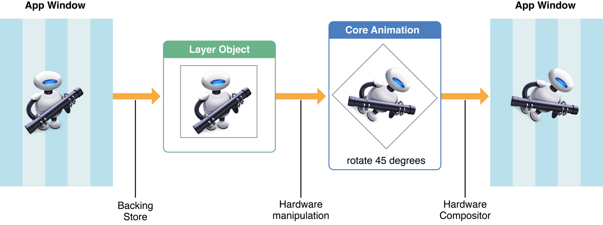
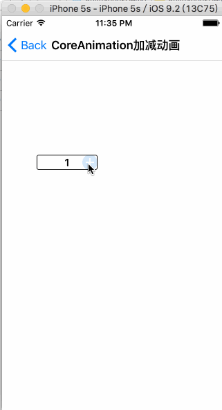
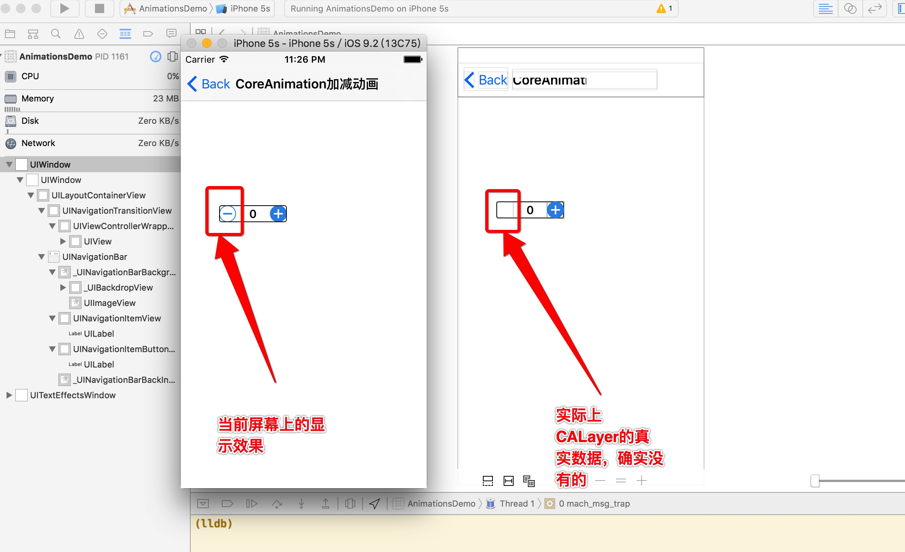
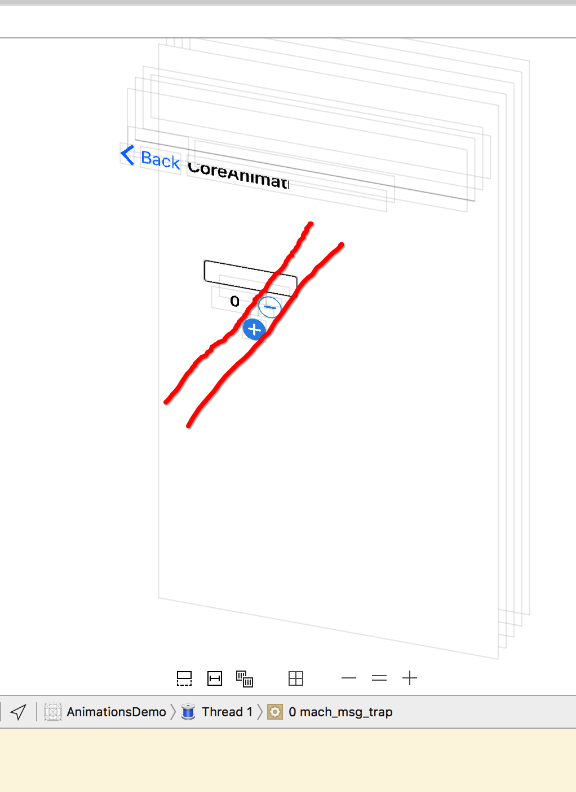
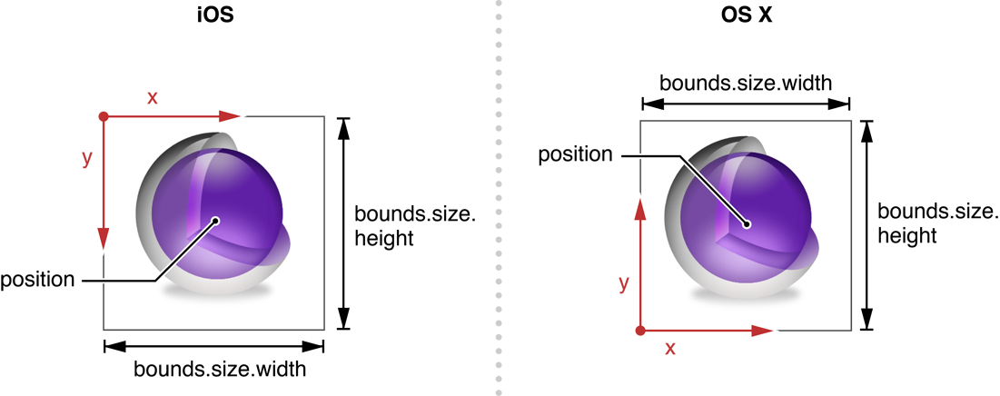
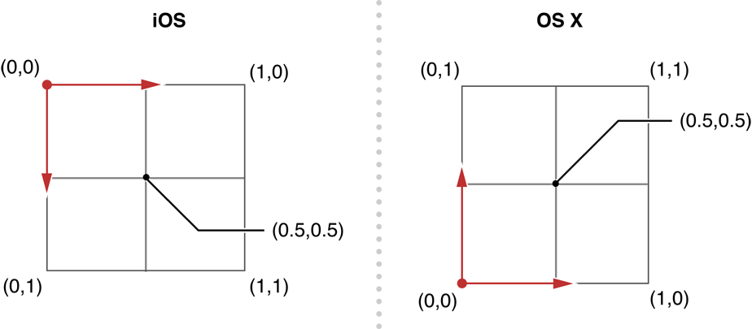
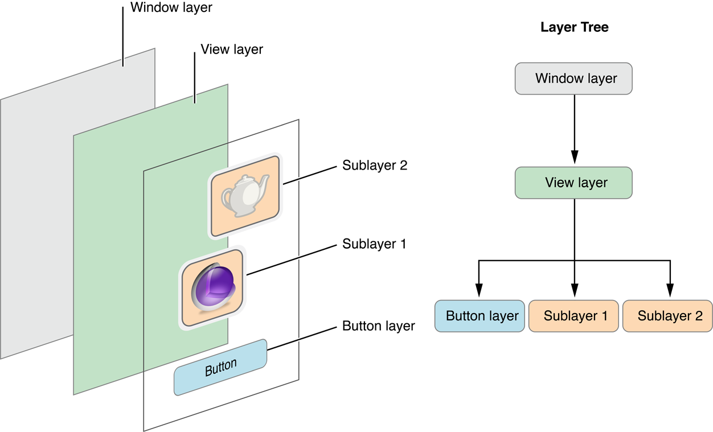
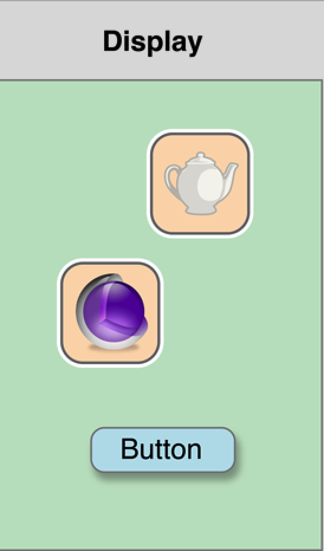
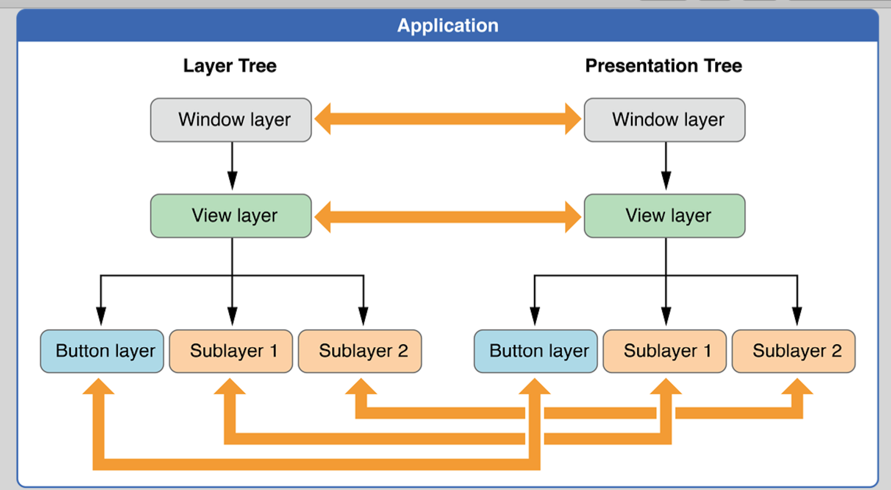
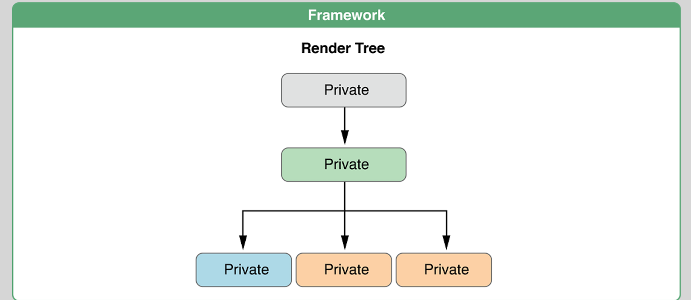

## 官方文档搜索

```
https://developer.apple.com/search/?q=Core Animation
```

## iOS系统中用于图形界面显示的组件结构 


CoreAnimation起到承上启下的作用，提供接口给UIKit用于界面数据显示，底层调用OpenGL或者CoreGraphics完成`文本\图形\图像`的绘制，最终的绘制渲染又是由硬件完成。


## CoreAnimation 不仅仅只是用于界面显示，而且还负责使用各种硬件完成合成处理屏幕显示的核心作用

- (1) 而最基础组件的就是CALayer对象

- (2) 我们所有将显示的数据扔给CALayer（text、backgroundColor、textColor、font、border、image...）

- (3) 由绘图硬件，将CALayer将所有的数据，渲染得到bitmap位图

- (4) 再将位图设置给CALayer的contents来管理

- (5) 最终再对当前屏幕上所有层叠的CALayer的contents图像进行合成处理为一张图像

- (6) 最终将合成的图像进行纹理处理，转换成显示器硬件所能识别的数据格式


## Core Animation Basics

- (1) 大多数的CALayer，并不会参与App中实际的绘图工作

- (2) CALayer作为捕获App中需要现实的数据，然后由其他组件负责渲染得到一个bitmap位图，CALayer然后将这个bitmap位图缓存起来，作为这个bitmap位图的缓存容器

- (3) 当之后对CALayer做出的属性值修改，只是修改CALayer对象关联的状态信息

- (4) CALayer的一个属性值修改，就会触发一个CoreAnimation动画

- (5) CoreAnimation将被修改的CALayer对象的contents存储的bitmap位图，发送给绘图硬件

- (6) 图像硬件使用新的状态信息，对传递过来的bitmap位图进行重新的渲染

### How Core Animation draws content 





可以分为如下几个步骤:

- (1) 设置的一个图像被渲染为bitmap，然后由一个CALayer对象的conents属性来存储

- (2) 当我们对CALayer对象进行各种属性值修改，都会触发一个CoreAnimation动画操作

- (3) CoreAnimation执行完产生的动画

- (4) 然后将此时CALayer的状态信息（旋转了多少度、移动了多少距离、透明度该多多少...）和contents属性值存储的bitmap，一起传送给绘图硬件进行重新的渲染

- (5) 绘图硬件将根据此时CALayer最新的各种状态数据，对bitmap重新渲染得到新的bitmap

- (6) 得到的新的bitmap，直接用于屏幕显示


大致意思好像是，当第一次对CALayer内部数据渲染得到bitmap之后，再次对CALayer的属性值做出修改，并不会再对CALayer保存的bitmap做出修改了，仅仅只是根据当前CALayer的各种属性值，对保存的bitmap重新进行渲染绘制到屏幕上。

### 为什么要这么做？

- (1) 基于UIView的绘图，当对UIView对象的属性值，做出修改之后，都会调用`-[UIView drawRect:]`使用新的参数值绘制contents

- (2) 但是基于UIView的绘图，必须处于`主线程`上使用`CPU`来完成，频繁的进行还是很影响CPU性能的

- (3) 而CoreAnimation只是对CALayer.contmts保存bitmap进行绘制，而避免每一次都重新绘制得新的contents

### 这也就是为什么，当一个CALayer执行完CoreAnimation之后，屏幕上好像是位置、大小、角度、透明度确实发生变化了，但其实CALayer的各种属性值并没有发生变化。

之前完成的一个减价号的CoreAnimation的demo:



可以看到减号确实出现在了最左侧，那么他的frame改变了吗？





当模拟器断点后，看到的CALayer对象其实还是在**原来的位置上**，那么就是说CALayer的frame值其实并**没有真正的改变**，在屏幕上看到的只是一个**假象**。

当CALayer内部的数据被绘图硬件渲染得到bitmap之后，会使用contents属性保存起来。

而随后的一些针对CALayer属性值的修改，并不会真正的触发对contents的重新绘制，而只是针对当前CALayer`状态信息（并没有真实改变）`读取CALayer的contents保存的bitmap，输出到屏幕上显示出一种假象。

即使CoreAnimation会尽可能的是要CALayer的contents缓存bitmap，但是我们的App程序仍然需要提供:

- (1) 一个初始化的content
- (2) 时不时的更新content

## CALayer的工作

- (1) 管理内部contents的几何图形结构
- (2) contents的bounds、contents出现在屏幕的position
- (3) rotated、scaled、transformed ...

## CALayer使用两种坐标系

- (1) `(x,y)` 形式的坐标系




- (2) `(0~1, 0~1)` 单位坐标系，适用于anchorPoint属性值设置



position为CALayer的中心坐标点（x,y）， 将会出现在 anchorPoint (0.5,0.5) 的位置上。


## CALayer使用三个层级树来让contents显示到屏幕上

- (1) model layer tree
- (2) presentation tree
- (3) render tree

## model layer tree

- (1) 与我们的App程序打交道最多的一个layer tree
- (2) 这个tree里面所有的object都是model模型数据
- (3) 每一个model数据，都是使用animations来包裹原始的数据值
- (4) 当改变CALayer的属性值时，就是使用其中的一个model数据

## presentation tree 

- (1) 主要包含一些正在running执行的animations
- (2) 这个tree中的每一个object，反应了`model layer tree`中`对应`的model此刻显示在屏幕上的值
- (3) 我们不能去修改这个tree里面的object的数据
- (4) 我们只能去读取这个tree里面的object数据，来获取animations此刻显示在屏幕上的数据


## render tree

- (1) 执行实际的动画绘制
- (2) 并调用CoreAnimation通知绘图硬件完成渲染

## 我们创建的各种UIView然后添加到UIWindow，最终其实都会转换为CALayer的层级关系



每一种类型的UIView都会转换为对应的CALayer的对象，从而转换为CALayer的层级关系。

## 对于一个存在于 model layer tree 中的object，都有一个与之对应的object，分别存在于 presentation tree 和 render tree

### 一、Display 当前屏幕上显示效果



看起来的样子，好像只有一个layer tree。

### 二、Application App应用层面的关系



我们可以读取CALayer的 presention tree 中对应的layer数据。

### 三、Framework 系统库层面的关系



全部都是私有的操作。

## CALayer 与 UIView 之间的关系

### CALayer的优势

- (1) 比UIView更轻量级
- (2) 更容易实现高效率的绘制、以及对contents的各种动画效果绘制
- (3) 可以保持很高的frame帧率

### CALayer的缺点

- (1) 不能处理UI事件
- (2) 不能进行contents的绘制
- (3) 不能参与UI事件的传递、响应链

### UIView就是对CALayer的一个包裹容器

- (1) CALayer的缺点，UIView都能办到
- (2) CALayer负责图像绘制的主要入口

## Enabling Core Animation Support in Your App

### 对于iOS App

- (1) Core Animation 默认是开启的
- (2) 所有的UIView对象都会自动创建 `backed CALayer` 对象

### 将某个自定义CALayer作为UIView的自动关联的backed CALayer

```objc
@implementation MyView

+ (Class) layerClass {
   return [MyLayer class];
}

@end
```

## Providing a Layer’s Contents

Layer’s Contents 就是屏幕上要显示的数据，实际上就是一个bitmap位图。

### 给CALayer提供一个bitmap的contents的三个方法

- (1) 直接给CALayer对象的contents属性，设置一个Image图像
- (2) 通过CALayerDelegate回调函数中，去draw绘制一个contents
- (3) 创建CALayer的子类，重写draw系统方法实现，完成绘制contents


第一种做法，适合于contents不会经常变化。

第二种做法，适合于contents可能会定期的发生改变，通过delegate通知外界进行重新绘制contents。

第三种做法，应该是属于效率最差的把。

### Using an Image for the Layer’s Content

