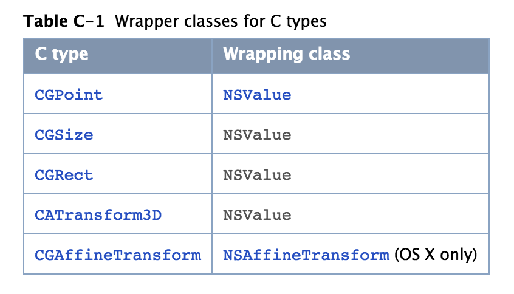

## 官方文档搜索

```
https://developer.apple.com/search/?q=Core Animation
```

## iOS系统中用于图形界面显示的组件结构 


CoreAnimation起到承上启下的作用，提供接口给UIKit用于界面数据显示，底层调用OpenGL或者CoreGraphics完成`文本\图形\图像`的绘制，最终的绘制渲染又是由硬件完成。


## CoreAnimation 不仅仅只是用于界面显示，而且还负责使用各种硬件完成合成处理屏幕显示的核心作用

- (1) 而最基础组件的就是CALayer对象

- (2) 我们所有将显示的数据扔给CALayer（text、backgroundColor、textColor、font、border、image...）

- (3) 由绘图硬件，将CALayer将所有的数据，渲染得到bitmap位图

- (4) 再将位图设置给CALayer的contents来管理

- (5) 最终再对当前屏幕上所有层叠的CALayer的contents图像进行合成处理为一张图像

- (6) 最终将合成的图像进行纹理处理，转换成显示器硬件所能识别的数据格式


## Core Animation Basics

- (1) 大多数的CALayer，并不会参与App中实际的绘图工作

- (2) CALayer作为捕获App中需要现实的数据，然后由其他组件负责渲染得到一个bitmap位图，CALayer然后将这个bitmap位图缓存起来，作为这个bitmap位图的缓存容器

- (3) 当之后对CALayer做出的属性值修改，只是修改CALayer对象关联的状态信息

- (4) CALayer的一个属性值修改，就会触发一个CoreAnimation动画

- (5) CoreAnimation将被修改的CALayer对象的contents存储的bitmap位图，发送给绘图硬件

- (6) 图像硬件使用新的状态信息，对传递过来的bitmap位图进行重新的渲染

### How Core Animation draws content 


可以分为如下几个步骤:

- (1) 设置的一个图像被渲染为bitmap，然后由一个CALayer对象的conents属性来存储

- (2) 当我们对CALayer对象进行各种属性值修改，都会触发一个CoreAnimation动画操作

- (3) CoreAnimation执行完产生的动画

- (4) 然后将此时CALayer的状态信息（旋转了多少度、移动了多少距离、透明度该多多少...）和contents属性值存储的bitmap，一起传送给绘图硬件进行重新的渲染

- (5) 绘图硬件将根据此时CALayer最新的各种状态数据，对bitmap重新渲染得到新的bitmap

- (6) 得到的新的bitmap，直接用于屏幕显示


大致意思好像是，当第一次对CALayer内部数据渲染得到bitmap之后，再次对CALayer的属性值做出修改，并不会再对CALayer保存的bitmap做出修改了，仅仅只是根据当前CALayer的各种属性值，对保存的bitmap重新进行渲染绘制到屏幕上。

### 为什么要这么做？

- (1) 基于UIView的绘图，当对UIView对象的属性值，做出修改之后，都会调用`-[UIView drawRect:]`使用新的参数值绘制contents

- (2) 但是基于UIView的绘图，必须处于`主线程`上使用`CPU`来完成，频繁的进行还是很影响CPU性能的

- (3) 而CoreAnimation只是对CALayer.contmts保存bitmap进行绘制，而避免每一次都重新绘制得新的contents

### 这也就是为什么，当一个CALayer执行完CoreAnimation之后，屏幕上好像是位置、大小、角度、透明度确实发生变化了，但其实CALayer的各种属性值并没有发生变化。

之前完成的一个减价号的CoreAnimation的demo:


可以看到减号确实出现在了最左侧，那么他的frame改变了吗？


当模拟器断点后，看到的CALayer对象其实还是在**原来的位置上**，那么就是说CALayer的frame值其实并**没有真正的改变**，在屏幕上看到的只是一个**假象**。

当CALayer内部的数据被绘图硬件渲染得到bitmap之后，会使用contents属性保存起来。

而随后的一些针对CALayer属性值的修改，并不会真正的触发对contents的重新绘制，而只是针对当前CALayer`状态信息（并没有真实改变）`读取CALayer的contents保存的bitmap，输出到屏幕上显示出一种假象。

即使CoreAnimation会尽可能的是要CALayer的contents缓存bitmap，但是我们的App程序仍然需要提供:

- (1) 一个初始化的content
- (2) 时不时的更新content

## CALayer的工作

- (1) 管理内部contents的几何图形结构
- (2) contents的bounds、contents出现在屏幕的position
- (3) rotated、scaled、transformed ...

## CALayer使用两种坐标系

- (1) `(x,y)` 形式的坐标系


- (2) `(0~1, 0~1)` 单位坐标系，适用于anchorPoint属性值设置


position为CALayer的中心坐标点（x,y）， 将会出现在 anchorPoint (0.5,0.5) 的位置上。


## CALayer使用三个层级树来让contents显示到屏幕上

- (1) model layer tree
- (2) presentation tree
- (3) render tree

## model layer tree

- (1) 与我们的App程序打交道最多的一个layer tree
- (2) 这个tree里面所有的object都是model模型数据
- (3) 每一个model数据，都是使用animations来包裹原始的数据值
- (4) 当改变CALayer的属性值时，就是使用其中的一个model数据

## presentation tree 

- (1) 主要包含一些正在running执行的animations
- (2) 这个tree中的每一个object，反应了`model layer tree`中`对应`的model此刻显示在屏幕上的值
- (3) 我们不能去修改这个tree里面的object的数据
- (4) 我们只能去读取这个tree里面的object数据，来获取animations此刻显示在屏幕上的数据


## render tree

- (1) 执行实际的动画绘制
- (2) 并调用CoreAnimation通知绘图硬件完成渲染

## 我们创建的各种UIView然后添加到UIWindow，最终其实都会转换为CALayer的层级关系


每一种类型的UIView都会转换为对应的CALayer的对象，从而转换为CALayer的层级关系。

## 对于一个存在于 model layer tree 中的object，都有一个与之对应的object，分别存在于 presentation tree 和 render tree

### 一、Display 当前屏幕上显示效果


看起来的样子，好像只有一个layer tree。

### 二、Application App应用层面的关系


我们可以读取CALayer的 presention tree 中对应的layer数据。

### 三、Framework 系统库层面的关系


全部都是私有的操作。

## CALayer 与 UIView 之间的关系

### CALayer的优势

- (1) 比UIView更轻量级
- (2) 更容易实现高效率的绘制、以及对contents的各种动画效果绘制
- (3) 可以保持很高的frame帧率

### CALayer的缺点

- (1) 不能处理UI事件
- (2) 不能进行contents的绘制
- (3) 不能参与UI事件的传递、响应链

### UIView就是对CALayer的一个包裹容器

- (1) CALayer的缺点，UIView都能办到
- (2) CALayer负责图像绘制的主要入口

## Enabling Core Animation Support in Your App

### 对于iOS App

- (1) Core Animation 默认是开启的
- (2) 所有的UIView对象都会自动创建 `backed CALayer` 对象

### 将某个自定义CALayer作为UIView的自动关联的backed CALayer

```objc
@implementation MyView

+ (Class) layerClass {
   return [MyLayer class];
}

@end
```

## Providing a Layer’s Contents

Layer’s Contents 就是屏幕上要显示的数据，实际上就是一个bitmap位图。

### 给CALayer提供一个bitmap的contents的三个方法

- (1) 直接给CALayer对象的contents属性，设置一个Image图像
- (2) 通过CALayerDelegate回调函数中，去draw绘制一个contents
- (3) 创建CALayer的子类，重写draw系统方法实现，完成绘制contents


第一种做法，适合于contents不会经常变化。

第二种做法，适合于contents可能会定期的发生改变，通过delegate通知外界进行重新绘制contents。

第三种做法，应该是属于效率最差的把。

### Using an Image for the Layer’s Content

- (1) 一个 CALayer 仅仅是用来管理 一个 bitmap 图像 的容器
- (2) 你可以直接给 CALayer的contents属性 设置一个 图像
- (3) 通过简单的给 CALayer的contents属性 赋值一个 图像对象，就可以完成将设置的图像显示到屏幕上
- (4) CALayer 直接使用 contents属性 指向的 图像，并不会使用拷贝副本 图像
- (5) 不会拷贝图像副本 可以节约内存使用，并可以在很多地方引用同一个 图像
- (6) 设置给 CALayer的contents属性的 图像类型 必须是 `CGImageRef`，否则显示空白
- (7) 图像需要提供对应iphone设备分辨率对应的图像
- (8) CALayer的 `contentsScale` 属性定义了`contents`的像素尺寸和大小的比例
- (9) 当图片被读取成为 `CGImageRef` 后，就会失去 `拉伸` 的概念，可能会会变得很大、边缘有锯齿
- (10) 通过 `layer.contentsScale = [UIScreen mainScreen].scale;`来修复 (9) 会出现的问题，专用图层会自动解决这个问题


### Using a Delegate to Provide the Layer’s Content

- (1) 如果你的 CALayer 的 contents内容 动态的发生变化
- (2) 可以通过 设置并实现 CALayerDelegate 回调函数中 完成 contents的 不断的更新
- (3) 那么如下两个函数将会按照顺序被调用

第一个是，`-[CALayer displayLayer:]` 主要完成

- (1) 即使是空实现，也会由系统自动创建一个空的bitmap
- (2) 然后将空的bimtap 设置给 contents

第二个时，CALayerDelegate中的 `drawLayer:inContext:` 主要完成

- (1) 由 Core Animation 先创建 bitmap
- (2) 由 Core Animation 再创建 graphics context，用于在其中进行任意的绘制操作
- (3) 当 `drawLayer:inContext:` 被调用完毕之后，将会取出 graphics context 中绘制的内容，将其填充到 bitmap 中


### Providing Layer Content Through Subclassing

重写CALayer的绘制函数，来创建contents。

## Tweaking the Content You Provide

- (1) 如果给layer设置的图像的尺寸，与layer的bounds尺寸，不是成比例，就会造成图像显示发生变形
- (2) 可以使用layer的 `contentsGravity` 属性来解决
- (3) 类似 `UIImageView` 的 `contentMode`属性 的作用

下面是一段代码的使用 contentsGravity 所有枚举值，来显示一个比 layer.bounds 大的 图像的所有效果图

```objc
- (void)test4 {
    CALayer *layer = [CALayer layer];
    layer.contentsScale = [UIScreen mainScreen].scale;
    layer.frame = CGRectMake(50, 84, 200, 450);
    layer.borderWidth = 5;
    layer.borderColor = [UIColor redColor].CGColor;
    
//    layer.contentsGravity = kCAGravityResize;//默认
//    layer.contentsGravity = kCAGravityResizeAspect;
//    layer.contentsGravity = kCAGravityResizeAspectFill;
//    layer.contentsGravity = kCAGravityCenter;
//    layer.contentsGravity = kCAGravityTop;
//    layer.contentsGravity = kCAGravityBottom;
//    layer.contentsGravity = kCAGravityLeft;
//    layer.contentsGravity = kCAGravityRight;
//    layer.contentsGravity = kCAGravityTopLeft;
//    layer.contentsGravity = kCAGravityTopRight;
//    layer.contentsGravity = kCAGravityBottomLeft;
//    layer.contentsGravity = kCAGravityBottomRight;
    
    
    layer.contents = (__bridge id _Nullable)([UIImage imageNamed:@"siwa"].CGImage);
    [self.view.layer addSublayer:layer];
}
```

kCAGravityResize ， 这个是默认的设置选项


kCAGravityResizeAspect


kCAGravityResizeAspectFill


kCAGravityCenter


kCAGravityTop


kCAGravityBottom


kCAGravityLeft


kCAGravityRight


kCAGravityTopLeft


kCAGravityTopRight


kCAGravityBottomLeft


kCAGravityBottomRight


## The Layer Redraw Policy for OS X Views Affects Performance

In `OS X`, layer-backed views support several different policies for determining when to update the underlying layer’s contents.

 Because there are differences between the native AppKit drawing model and the one introduced by Core Animation, these policies make it easier to migrate your older code over to Core Animation. 
 
You can configure these policies on a view-by-view basis to ensure the best performance for each of your views.

Each view defines a `layerContentsRedrawPolicy` method that returns the redraw policy for the view’s layer. You set the policy using the `setLayerContentsRedrawPolicy:` method. To preserve compatibility with its traditional drawing model, AppKit sets the redraw policy to NSViewLayerContentsRedrawDuringViewResize by default. However, you can change the policy to any of the values in Table 2-2. Notice that the recommended redraw policy is not the default policy.

### NSViewLayerContentsRedrawOnSetNeedsDisplay

- (1) This is the recommended policy 推荐的模式

- (2) view geometry changes do not automatically cause the view to update its layer’s contents view的几何结构发生变化后，不会自动触发更新layer的contents

- (3) the layer’s existing contents are stretched and manipulated to facilitate the geometry changes 值是对layer的contents进行拉伸、形变做一些几何变换

- (4) To force the view to redraw itself and update the layer’s contents, you must explicitly call the view’s setNeedsDisplay: method 也就是主动调用 `setNeedsDisplay:` 通知需要更新contents

- (5) This policy most closely represents the standard behavior for Core Animation layers 这个策略更接近CoreAnimation的标准行为

- (6) However, it is not the default policy and must be set explicitly 它不是默认策略，必须显式设置

### NSViewLayerContentsRedrawDuringViewResize

- (1) This is the `default` redraw policy

- (2) This policy maintains maximum compatibility with traditional AppKit drawing by recaching the layer’s contents whenever the view’s geometry changes 这个策略让AppKit在对layer的contents 无论何时发生变化后进行传入的传统绘制时，保持了最大兼容性

- (3)  This behavior results in the view’s `drawRect:` method being called multiple times on your app’s main thread during the resize operation

### NSViewLayerContentsRedrawBeforeViewResize

- (1) AppKit draws the layer at its final size prior to any resize operations and caches that bitmap 绘制最终的layer尺寸之前会进行很多的尺寸调整 并缓存bitmap

- (2) The resize operation uses the cached bitmap as the starting image, scaling it to fit the old bounds rectangle 对layer的contents保存的缓存bitmap进行一些缩放去适应老的bounds区域

- (3) It then animates the bitmap to its final size 然后使用动画显示bitmap，并改变为最终的尺寸

- (4) This behavior can cause the view’s contents to appear stretched or distorted at the beginning of an animation and is better in situations where the initial appearance is not important or not noticeable


### NSViewLayerContentsRedrawNever 

- (1) AppKit does not update the layer at all 根本就不会更新layer

- (2) even when you call the `setNeedsDisplay:` method 

- (3) This policy is most appropriate for views whose contents `never change` and where the size of the view changes infrequently if at all

- (4) For example, you might use this for views that display fixed-size content or `background elements`

## Adding Custom Properties to a Layer


The CAAnimation and CALayer classes are key-value coding compliant container classes, which means that you can set values for arbitrary（任意） keys.

Even if the key someKey is `not a declared property （不用声明成属性）` of the CALayer class, you can still set a value for it as follows:

```c
[theLayer setValue:[NSNumber numberWithInteger:50] forKey:@"someKey"];
```

You can also retrieve the value for arbitrary keys like you would retrieve the value for other key paths. For example, to retrieve the value of the someKey path set previously, you would use the following code:

```c
someKeyValue=[theLayer valueForKey:@"someKey"];
```

### Key-Value Coding Extensions

开发文档搜  `Key-Value Coding Compliant Container Classes` 也可以如下地址打开

```
https://developer.apple.com/library/content/documentation/Cocoa/Conceptual/CoreAnimation_guide/SettingUpLayerObjects/SettingUpLayerObjects.html#//apple_ref/doc/uid/TP40004514-CH13-SW12
```

Core Animation extends the `NSKeyValueCoding Protocol` as it pertains to the CAAnimation and CALayer classes. 

This extension adds default values for some keys, expands wrapping conventions, and adds key path support for CGPoint, CGRect, CGSize, and CATransform3D types.

## Key-Value Coding Compliant Container Classes

### Default Value Support

- (1) 就是可以给一个自定义key一个默认的value
- (2) CAAnimation 和 CALayer 可以是 `defaultValueForKey:` 来设置key的默认value

继承自CALayer得到一个子类，重写 `defaultValueForKey:` 给 key 一个默认的vaue。下面是给CALayer的 masksToBounds 一个 默认的 value 

```objc
@interface MyLayer : CALayer
@end
@implementation MyLayer

+ (id)defaultValueForKey:(NSString *)key {
    
    //1. 配置默认值的key
    if ([key isEqualToString:@"masksToBounds"]) {
        return [NSNumber numberWithBool:YES];
    }
    
    //2. 其他的key，不配置默认值
    return [super defaultValueForKey:key];
}

@end
```

从这里也可以得到，`CALayer 和 CAAniation` 其实并没有 `@property` ，其实是通过 `key-value` 的形式存储的。

### Wrapping Conventions


- (1) 当如果给 CALayer 提供 c struct 实例时，必须使用 objc 数据类型进行包裹

- (2) 然后当 在读取 包裹的 c struct 时，又需要解析出来使用


#### c struct 与 objc 的包裹转换



### Key Path Support for Structures

就类似 KVC 的 keyPath 使用，比如：

```c
[myLayer setValue:[NSNumber numberWithFloat:10.0] forKeyPath:@"transform.translation.x"];
```

上面说了，CALayer 和 CAAnimation 就是就是 基于 key-value 键值对的形式存储属性值的。

### 1. CATransform3D Key Paths


### 2. 一个综合的demo

```objc
- (void)touchesBegan:(NSSet<UITouch *> *)touches withEvent:(UIEvent *)event {
    
    CALayer *layer = [CALayer layer];
    
    // 1.
    [layer setValue:@(1) forKey:@"borderWidth"];
    [layer setValue:(__bridge id)([UIColor redColor].CGColor) forKey:@"borderColor"];
    [layer setValue:@(100) forKeyPath:@"frame.size.width"];
    [layer setValue:@(100) forKeyPath:@"frame.size.height"];
    [layer setValue:@(20) forKeyPath:@"frame.origin.x"];
    [layer setValue:@(100) forKeyPath:@"frame.origin.y"];
    
    //2.
//    layer.frame = CGRectMake(20, 100, 100, 100);
//    layer.borderColor = [UIColor redColor].CGColor;
//    layer.borderWidth = 1;
    
    [self.view.layer addSublayer:layer];
}
```

所以，对于 CALayer 和 CAAnimation 的对象， 可以像使用 NSDictionary 一样，使用任意的 key或keyPath 来读写 value。


## Changing the Layer Object Associated with a View

改变 View 内部关联的 CALayer。

```objc
@interface MyView : UIView
@end
@implementation MyView

+ (Class)layerClass {
    return [MyLayer class];
}

@end
```

## Changing a Layer’s Default Behavior

### 定义

- (1) CALayer对象 包含了 很多的 CAAction协议实现类的对象
- (2) 这些包含的 CAAction协议实现类的对象 ，在当 CALayer 属性值修改时被执行

### CAAction 协议

```objc
@protocol CAAction

- (void)runActionForKey:(NSString *)event 
				 object:(id)anObject
		      arguments:(nullable NSDictionary *)dict;

@end
```

只有一个方法需要实现，这个函数实现，就是当CALayer的属性值改变时，给CALayer完成一些隐式动画的。

我们可以，自己实现CAAction协议，并注册给CALayer。

### 当CALayer属性值被修改时，会从注册的所有的CAAction实现类对象中，查询得到对应的CAAction实现类对象继而执行

#### 当CALayer属性值被修改时，按照如下顺序查找CAAction实现类对象

- (1) 是否实现了 `CALayerDelegate` 中的 `actionForLayer:forKey:`，如果实现了则调用这个函数实现。但是delegate实现函数，必须做如下操作之一:
	- (1.1) Return the `action object` for the given key 会执行隐式动画
	- (1.2) Return `nil` if it does not handle the action, in which case the search continues 继续执行搜索action
	- (1.3) Return the `NSNull` object, in which case the search ends immediately 停止搜索，不会产生隐式动画

- (2) 继续从 CALayer对象的 `actions` 这个dictionary 中查询

```objc
@property(nullable, copy) NSDictionary<NSString *, id<CAAction>> *actions;
```

- (3) 继续从 CALayer对象的 `style` 这个dictionary 中查询

```objc
@property(nullable, copy) NSDictionary *style;
```

- (4) 调用 CALayer对象的 `defaultActionForKey:`

#### Where you install your action objects depends on how you intend to modify the layer.

- (1) For actions that you might apply only in specific circumstances, or for layers that already use a delegate object, provide a delegate and implement its `actionForLayer:forKey:` method.

- (2) For layer objects that do not normally use a delegate, add the action to the layer’s `actions dictionary`.

- (3) For actions related to custom properties that you define on the layer object, include the action in the layer’s `style dictionary`.

- (4) For actions that are fundamental to the behavior of the layer, subclass the layer and override the `defaultActionForKey:` method.

下面是一个修改 CALayer 对象的 `backgroundColor` 属性值时， 做一个转场动画。

首先是自定义的CALayer子类：

```objc
@interface MyLayer : CALayer
@end
@implementation MyLayer

- (id<CAAction>)actionForKey:(NSString *)event {
    
    //1. 如果修改contents属性值，则做一个转场动画
    if ([event isEqualToString:@"backgroundColor"]) {
        CATransition *theAnimation = nil;
        theAnimation = [[CATransition alloc] init];
        theAnimation.duration = 2.0;
        theAnimation.timingFunction = [CAMediaTimingFunction functionWithName:kCAMediaTimingFunctionEaseIn];
        theAnimation.type = kCATransitionPush;
        theAnimation.subtype = kCATransitionFromRight;
        return theAnimation;
    }
    
    //2.
    return [super actionForKey:event];
}

@end
```

注意，CATransition 也是实现了 CAAction协议的，所以也是能够做 隐式动画效果的。

然后是测试

```objc
@interface BasicViewController () {
    MyLayer *layer1;
}
@end

@implementation BasicViewController

- (void)viewDidLoad {
    [super viewDidLoad];

	layer1 = [MyLayer layer];
    [layer1 setValue:@(1) forKey:@"borderWidth"];
    [layer1 setValue:(__bridge id)([UIColor redColor].CGColor) forKey:@"borderColor"];
    [layer1 setValue:@(100) forKeyPath:@"frame.size.width"];
    [layer1 setValue:@(100) forKeyPath:@"frame.size.height"];
    [layer1 setValue:@(20) forKeyPath:@"frame.origin.x"];
    [layer1 setValue:@(100) forKeyPath:@"frame.origin.y"];
    [self.view.layer addSublayer:layer1];
}

- (void)touchesBegan:(NSSet<UITouch *> *)touches withEvent:(UIEvent *)event {

	//1.
    CGFloat red = arc4random() / (CGFloat)INT_MAX;
    CGFloat green = arc4random() / (CGFloat)INT_MAX;
    CGFloat blue = arc4random() / (CGFloat)INT_MAX;
    UIColor *color = [UIColor colorWithRed:red green:green blue:blue alpha:1.0];
    
    //2.
    layer1.backgroundColor = color.CGColor;
}

@end
```

下面是效果图


#### 当修改CALayer属性值时，默认会产生隐式动画，那么可以通过如下方法来禁止自动播放隐式动画

```objc
[CATransaction begin];
[CATransaction setValue:(id)kCFBooleanTrue
                 forKey:kCATransactionDisableActions];
[aLayer removeFromSuperlayer];
[CATransaction commit];
```

## 转场动画 CATransition

上面有一个简单的例子了，下面是一个结合 CoreImageFilter 的例子

```objc
CIFilter* aFilter = [CIFilter filterWithName:@"CIBarsSwipeTransition"];
[aFilter setValue:[NSNumber numberWithFloat:3.14] forKey:@"inputAngle"];
[aFilter setValue:[NSNumber numberWithFloat:30.0] forKey:@"inputWidth"];
[aFilter setValue:[NSNumber numberWithFloat:10.0] forKey:@"inputBarOffset"];
    
// Create the transition object
CATransition* transition = [CATransition animation];
transition.startProgress = 0;
transition.endProgress = 1.0;
transition.filter = aFilter;
transition.duration = 1.0;

// 
[layer addAnimation:transition forKey:@"jaja"];
```

## Pausing and Resuming Animations

暂停 和 恢复 执行 animation.

```objc
-(void)pauseLayer:(CALayer*)layer {

	//1. 得到停止layer动画的时间
   CFTimeInterval pausedTime = [layer convertTime:CACurrentMediaTime() fromLayer:nil];
   
   //2. 设置速度为0
   layer.speed = 0.0;
   
   //3. 设置layer的停止到的动画时间offset
   layer.timeOffset = pausedTime;
}
 
-(void)resumeLayer:(CALayer*)layer {

	//1. 获取layer动画停止时刻的时间
   CFTimeInterval pausedTime = [layer timeOffset];
   
   //2. 恢复速度为1
   layer.speed = 1.0;
   
   //3. 清除offset
   layer.timeOffset = 0.0;
   
   //4. 
   layer.beginTime = 0.0;
   CFTimeInterval timeSincePause = [layer convertTime:CACurrentMediaTime() fromLayer:nil] - pausedTime;
   layer.beginTime = timeSincePause;
}
```