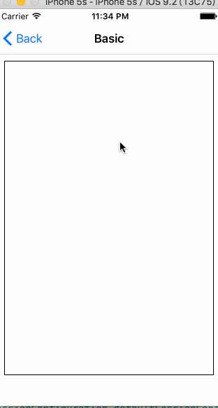

## ImageIO学习记录

苹果的官方文档:

```
https://developer.apple.com/library/content/documentation/GraphicsImaging/Conceptual/ImageIOGuide/imageio_intro/ikpg_intro.html#//apple_ref/doc/uid/TP40005462
```

所以，如果没有搜索到具体完整的学习文章，就去苹果官方的开发文档中搜索，直接看比较完整的英文介绍体系，然后再去单独的深入搜索某一些点。

```
https://developer.apple.com/search/?q=关键词
```

## Image I/O

The Image I/O programming interface framework allows applications to read and write most image file formats. This framework offers high efficiency, color management, and access to image metadata.

图像I/O编程接口框架允许应用程序读取和写入大多数图像文件格式。该框架提供了高效率，色彩管理，并获得图像元数据。

有两个主要的概念：

- (1) 读取某一个图像文件 >>> `CGImageSourceRef`
- (2) 将图像数据写入到某一个文件 >>> `CGImageDestinationRef`

## 使用ImageI/O能够干什么

- (1) 用来读取和写入图像文件，可以立刻对图片数据进行解码并缓存
- (2) 支持非常多的图像文件格式
- (3) mac平台上的最快的图像解码和编码的方式
- (4) 完成一部分一部分渐进形式的加载图片
- (5) 支持图像元数据的读写

## 在不同的系统平台，支持的图片格式也不同，可通过如下代码查看当前系统平台支持的所有图片格式

比如，我们运行 iOS App 程序 执行如下代码，可以分别打印出当前系统环境下，支持的可以读取的图片格式、写入的图片格式

```objc
#import <ImageIO/ImageIO.h>

@implementation BasicVC

- (void)touchesBegan:(NSSet<UITouch *> *)touches withEvent:(UIEvent *)event {

	//1. 可以读取的图片格式
    CFArrayRef mySourceTypes = CGImageSourceCopyTypeIdentifiers();
    CFShow(mySourceTypes);
    
    //2. 可以写入的图片格式
    CFArrayRef myDestinationTypes = CGImageDestinationCopyTypeIdentifiers();
    CFShow(myDestinationTypes);
}

@end
```

输出结果

```
<CFArray 0x7f85e3e34950 [0x10ee017b0]>{type = mutable-small, count = 40, values = (
	0 : <CFString 0x10f2e7958 [0x10ee017b0]>{contents = "public.png"}
	1 : <CFString 0x10f2e68d8 [0x10ee017b0]>{contents = "public.jpeg"}
	2 : <CFString 0x10f2e6938 [0x10ee017b0]>{contents = "com.compuserve.gif"}
	3 : <CFString 0x11bd6d7a8 [0x10ee017b0]>{contents = "com.canon.tif-raw-image"}
	4 : <CFString 0x11bd6d7c8 [0x10ee017b0]>{contents = "com.adobe.raw-image"}
	5 : <CFString 0x11bd6d7e8 [0x10ee017b0]>{contents = "com.canon.cr2-raw-image"}
	6 : <CFString 0x11bd6d808 [0x10ee017b0]>{contents = "com.leafamerica.raw-image"}
	7 : <CFString 0x11bd6d828 [0x10ee017b0]>{contents = "com.hasselblad.fff-raw-image"}
	8 : <CFString 0x11bd6d848 [0x10ee017b0]>{contents = "com.hasselblad.3fr-raw-image"}
	9 : <CFString 0x11bd6d868 [0x10ee017b0]>{contents = "com.nikon.raw-image"}
	10 : <CFString 0x11bd6d888 [0x10ee017b0]>{contents = "com.nikon.nrw-raw-image"}
	11 : <CFString 0x11bd6d8a8 [0x10ee017b0]>{contents = "com.pentax.raw-image"}
	12 : <CFString 0x11bd6d8c8 [0x10ee017b0]>{contents = "com.samsung.raw-image"}
	13 : <CFString 0x11bd6d8e8 [0x10ee017b0]>{contents = "com.sony.raw-image"}
	14 : <CFString 0x11bd6d908 [0x10ee017b0]>{contents = "com.sony.sr2-raw-image"}
	15 : <CFString 0x11bd6d928 [0x10ee017b0]>{contents = "com.sony.arw-raw-image"}
	16 : <CFString 0x11bd6d948 [0x10ee017b0]>{contents = "com.epson.raw-image"}
	17 : <CFString 0x11bd6d968 [0x10ee017b0]>{contents = "com.kodak.raw-image"}
	18 : <CFString 0x10f2e6658 [0x10ee017b0]>{contents = "public.tiff"}
	19 : <CFString 0x11bd6d988 [0x10ee017b0]>{contents = "com.canon.crw-raw-image"}
	20 : <CFString 0x11bd6d9a8 [0x10ee017b0]>{contents = "com.fuji.raw-image"}
	21 : <CFString 0x11bd6d9c8 [0x10ee017b0]>{contents = "com.panasonic.raw-image"}
	22 : <CFString 0x11bd6d9e8 [0x10ee017b0]>{contents = "com.panasonic.rw2-raw-image"}
	23 : <CFString 0x11bd6da08 [0x10ee017b0]>{contents = "com.leica.raw-image"}
	24 : <CFString 0x11bd6da28 [0x10ee017b0]>{contents = "com.leica.rwl-raw-image"}
	25 : <CFString 0x11bd6da48 [0x10ee017b0]>{contents = "com.konicaminolta.raw-image"}
	26 : <CFString 0x11bd6da68 [0x10ee017b0]>{contents = "com.olympus.sr-raw-image"}
	27 : <CFString 0x11bd6da88 [0x10ee017b0]>{contents = "com.olympus.or-raw-image"}
	28 : <CFString 0x11bd6daa8 [0x10ee017b0]>{contents = "com.olympus.raw-image"}
	29 : <CFString 0x10f2e7ab8 [0x10ee017b0]>{contents = "com.microsoft.ico"}
	30 : <CFString 0x10f2e7af8 [0x10ee017b0]>{contents = "com.microsoft.bmp"}
	31 : <CFString 0x10f2e7ad8 [0x10ee017b0]>{contents = "com.microsoft.cur"}
	32 : <CFString 0x10f2e7b38 [0x10ee017b0]>{contents = "com.truevision.tga-image"}
	33 : <CFString 0x10f2e7938 [0x10ee017b0]>{contents = "public.jpeg-2000"}
	34 : <CFString 0x10f2e7b78 [0x10ee017b0]>{contents = "public.mpo-image"}
	35 : <CFString 0x10f2e7b98 [0x10ee017b0]>{contents = "public.pbm"}
	36 : <CFString 0x10f2e7bb8 [0x10ee017b0]>{contents = "public.pvr"}
	37 : <CFString 0x10f2e7bd8 [0x10ee017b0]>{contents = "org.khronos.astc"}
	38 : <CFString 0x10f2e7bf8 [0x10ee017b0]>{contents = "org.khronos.ktx"}
	39 : <CFString 0x10f2e7918 [0x10ee017b0]>{contents = "com.apple.rjpeg"}
)}


<CFArray 0x7f85e3d04d20 [0x10ee017b0]>{type = mutable-small, count = 14, values = (
	0 : <CFString 0x10f2e7958 [0x10ee017b0]>{contents = "public.png"}
	1 : <CFString 0x10f2e68d8 [0x10ee017b0]>{contents = "public.jpeg"}
	2 : <CFString 0x10f2e6938 [0x10ee017b0]>{contents = "com.compuserve.gif"}
	3 : <CFString 0x10f2e6658 [0x10ee017b0]>{contents = "public.tiff"}
	4 : <CFString 0x10f2e7ab8 [0x10ee017b0]>{contents = "com.microsoft.ico"}
	5 : <CFString 0x10f2e7af8 [0x10ee017b0]>{contents = "com.microsoft.bmp"}
	6 : <CFString 0x10f2e7a38 [0x10ee017b0]>{contents = "com.adobe.pdf"}
	7 : <CFString 0x10f2e7b38 [0x10ee017b0]>{contents = "com.truevision.tga-image"}
	8 : <CFString 0x10f2e7938 [0x10ee017b0]>{contents = "public.jpeg-2000"}
	9 : <CFString 0x10f2e7b98 [0x10ee017b0]>{contents = "public.pbm"}
	10 : <CFString 0x10f2e7bb8 [0x10ee017b0]>{contents = "public.pvr"}
	11 : <CFString 0x10f2e7bd8 [0x10ee017b0]>{contents = "org.khronos.astc"}
	12 : <CFString 0x10f2e7bf8 [0x10ee017b0]>{contents = "org.khronos.ktx"}
	13 : <CFString 0x10f2e7918 [0x10ee017b0]>{contents = "com.apple.rjpeg"}
)}
```

## ImageIO 的主要组成

### 一、CGImageSourceRef

```c
typedef struct IIO_BRIDGED_TYPE(id) CGImageSource * CGImageSourceRef
```

负责读取某一个路径下的图像文件。

### 二、CGImageDestinationRef

```c
typedef struct IIO_BRIDGED_TYPE(id) CGImageDestination * CGImageDestinationRef;
```

负责将当前内存中的图像数据，写入到指定的某一个路径文件中。

### 三、CGImageMetadataRef

```c
typedef const struct IIO_BRIDGED_TYPE(id) CGImageMetadata *CGImageMetadataRef;
```

保存图像文件的各种元数据。

### 四、CGImageProperties.h

该文件中定义了很多的常量`CFStringRef`类型的值，用于图像文件读取、写入时候的一些参数设置。

### 五、ImageIOBase.h

主要是一些预处理逻辑，无需关心。


## Creating and Using Image Sources

https://developer.apple.com/library/content/documentation/GraphicsImaging/Conceptual/ImageIOGuide/imageio_source/ikpg_source.html#//apple_ref/doc/uid/TP40005462-CH218-SW3


### demo1. Creating an Image from an Image Source 从一个CGImageSourceRef中获取Image，解压缩图片文件并在内存中缓存起来

CGImageSource类的主要作用是用来读取图片数据，在平时开发中，关于图片我们使用的最多的可能是**UIImage**类。UIImage是iOS系统UI系统中用于构建图像对象的类，但是其中**只有图像数据**。

实际上一个图片文件中存储的除了图片数据外，还有一些**地理位置、设备类型、时间等信息**，除此之外，一个图片文件中可能存储的也不只一张图像(例如gif文件)。

**CGImageSource**是一个既包含图片数据，又包含该图片文件本身的各种元数据记录，是对**一个图片文件，完整的抽象**，而不仅仅只是图片本身的显示的数据。


```c
CGImageRef MyCreateCGImageFromFile (NSString* path)
{
    //1. filepath 转换成 NSURL
    NSURL *url = [NSURL fileURLWithPath:path];
    
	//2. 
    CGImageRef        myImage = NULL;
    CGImageSourceRef  myImageSource;
    CFDictionaryRef   myOptions = NULL;
    CFStringRef       myKeys[2];
    CFTypeRef         myValues[2];
 
    /**
     *	Set up options if you want them. The options here are for
     *  caching the image in a decoded form and for using floating-point values if the image format supports them.
     * 
     * 3. 设置缓存解压之后的图像文件数据
     */
    myKeys[0] = kCGImageSourceShouldCache;//缓存解压后的图像文件数据
    myValues[0] = (CFTypeRef)kCFBooleanTrue;
    myKeys[1] = kCGImageSourceShouldAllowFloat;//以浮点型存储图像
    myValues[1] = (CFTypeRef)kCFBooleanTrue;

    //4. 将上面的设置，包装为一个dictionary字典
    myOptions = CFDictionaryCreate(
									NULL,
							  		(const void **) myKeys,
                   			  		(const void **) myValues, 
                   			  		2,
                   			  		&kCFTypeDictionaryKeyCallBacks,
                   			  		&kCFTypeDictionaryValueCallBacks
                   			  	   );                   
    
    //5. Create an CGImageSourceRef instance from the NSURL
    myImageSource = CGImageSourceCreateWithURL((CFURLRef)url, myOptions);
    
    //6. 释放废弃掉不再使用的 options dictionary 对象
    CFRelease(myOptions);
    
    //7. Make sure the image source exists before continuing
    if (myImageSource == NULL){
        fprintf(stderr, "Image source is NULL.");
        return  NULL;
    }
    
    //8. Create an image from the first item in the image source.
    myImage = CGImageSourceCreateImageAtIndex(myImageSource,
                                           	  0,
                                           	  NULL);
 
 	//9. 释放废弃CGImageSourceRef实例
    CFRelease(myImageSource);
    
    //10. Make sure the image exists before continuing
    if (myImage == NULL){
         fprintf(stderr, "Image not created from image source.");
         return NULL;
    }
 
 	//11. 解压缩并缓存后的图像 CGImageRef 实例
    return myImage;
}
```

### demo2. Creating a Thumbnail Image from an Image Source 从CGImageSourceRef中获取一个缩略图像

```c
CGImageRef MyCreateThumbnailImageFromData (NSData * data, int imageSize)
{
    //1.
    CGImageRef        myThumbnailImage = NULL;
    CGImageSourceRef  myImageSource;
    CFDictionaryRef   myOptions = NULL;
    CFStringRef       myKeys[3];
    CFTypeRef         myValues[3];
    CFNumberRef       thumbnailSize;
    
    //2. Create an image source from NSData; no options.
    myImageSource = CGImageSourceCreateWithData((CFDataRef)data, NULL);

    //3. Make sure the image source exists before continuing.
    if (myImageSource == NULL){
        fprintf(stderr, "Image source is NULL.");
        return  NULL;
    }
    
    //4. 创建缩略图等比缩放大小，会根据长宽值比较大的作为imageSize进行缩放
    thumbnailSize = CFNumberCreate(NULL, kCFNumberIntType, &imageSize);
    
    //5. Set up the thumbnail options.
    myKeys[0] = kCGImageSourceCreateThumbnailWithTransform;
    myValues[0] = (CFTypeRef)kCFBooleanTrue;
    myKeys[1] = kCGImageSourceCreateThumbnailFromImageIfAbsent;
    myValues[1] = (CFTypeRef)kCFBooleanTrue;
    myKeys[2] = kCGImageSourceThumbnailMaxPixelSize;
    myValues[2] = (CFTypeRef)thumbnailSize;
    
    //6. options dictionary
    myOptions = CFDictionaryCreate(NULL,
                                   (const void **) myKeys,
                                   (const void **) myValues,
                                   3,
                                   &kCFTypeDictionaryKeyCallBacks,
                                   &kCFTypeDictionaryValueCallBacks);
    
    //7. Create the thumbnail image using the specified options.
    myThumbnailImage = CGImageSourceCreateThumbnailAtIndex(myImageSource,
                                                           0,
                                                           myOptions);
    
    //8. Release the options dictionary and the image source when you no longer need them.
    CFRelease(thumbnailSize);
    CFRelease(myOptions);
    CFRelease(myImageSource);
    
    //9. Make sure the thumbnail image exists before continuing.
    if (myThumbnailImage == NULL){
        fprintf(stderr, "Thumbnail image not created from image source.");
        return NULL;
    }
    
    return myThumbnailImage;
}
```

可以理解为一个等比例缩放的图像。

### demo3. Incrementally Loading an Image 逐步的一部分一部分加载图片

先看下完成的效果图



从效果，可以看出，图片是一部分一部分的慢慢的加载，当网速越慢就越明显。

```c
@interface BasicVC () <NSURLSessionDelegate>
@end

@implementation BasicVC {
    UIImageView                 *_imageV;
    NSURLSession                *_session;
    NSURLSessionDataTask        *_task;
    CGImageSourceRef            _incrementallyImgSource;
    UIImage                     *_incrementallyImg;
    NSMutableData               *_receiveData;
    double                      _receivePercent;
    long long                   _expectedLeght;
    BOOL                        _finish;
}

- (void)viewDidLoad {
    [super viewDidLoad];
    
    _imageV = [[UIImageView alloc] initWithFrame:CGRectMake(10, 74, 300, 450)];
    _imageV.layer.borderWidth = 1;
    [self.view addSubview:_imageV];
}

/**
 *  渐进式加载网络高清大图
 */
- (void)test2 {
    NSURLRequest *request = [NSURLRequest requestWithURL:[NSURL URLWithString:imageurl]];
    
    _session = [NSURLSession sessionWithConfiguration:[NSURLSessionConfiguration defaultSessionConfiguration]
                                             delegate:self
                                        delegateQueue:[[NSOperationQueue alloc] init]];
    
    _task = [_session dataTaskWithRequest:request];
    
    _receiveData = [[NSMutableData alloc] init];
    
    _receivePercent = 0;
    
    /**
     *  预先创建一个渐进式的ImageSource实例
     */
    _incrementallyImgSource = CGImageSourceCreateIncremental(NULL);
    
    // 开始加载大图
    [_task resume];
}

- (void)releaseMemory {
    [_session invalidateAndCancel];
    _session = nil;
    _task = nil;
    _receiveData = nil;
    
    // 废弃系统对象
    if (_incrementallyImgSource) {
        CFRelease(_incrementallyImgSource);
        _incrementallyImgSource = NULL;
    }
}

// 下载进度
- (void)URLSession:(NSURLSession *)session dataTask:(NSURLSessionDataTask *)dataTask
didReceiveResponse:(NSURLResponse *)response
 completionHandler:(void (^)(NSURLSessionResponseDisposition disposition))completionHandler
{
    _expectedLeght = response.expectedContentLength;
    NSLog(@"Expected Length: %lld", _expectedLeght);
    
    NSString *mimeType = response.MIMEType;
    NSLog(@"MIME TYPE %@", mimeType);
    
    _finish = NO;
    
    // 允许处理服务器的响应，才会继续接收服务器返回的数据
    completionHandler(NSURLSessionResponseAllow);
}

// 不断的接收到部分数据
- (void)URLSession:(NSURLSession *)session dataTask:(NSURLSessionDataTask *)dataTask
    didReceiveData:(NSData *)data
{
    //1. 拼接部分图像数据
    [_receiveData appendData:data];
    
    //2.
    _finish = NO;
    if (_expectedLeght == _receiveData.length) {
        _finish = YES;
    }
    
    //3. 异步子线程完成将部分图像数据渲染得到CGImageRef，并设置给layer显示
    dispatch_async(dispatch_get_global_queue(0, 0), ^() {
        
        //3.1 将每次接收到的部分数据，拼接起来，更新渐进式的ImageSource实例
        CGImageSourceUpdateData(_incrementallyImgSource, (CFDataRef)_receiveData, _finish);
        
        //3.2 从渐进式的ImageSource中获取当前的渲染得到的CGImageRef图像
        CGImageRef cgimage = CGImageSourceCreateImageAtIndex(_incrementallyImgSource, 0, NULL);
        
        //3.3 CGImageRef 转 UIImage
        UIImage *uiimage = [UIImage imageWithCGImage:cgimage];
        
        //3.4 废弃掉CGImageRef
        CGImageRelease(cgimage);
        
        //3.5 主线程设置layer.contents
        dispatch_async(dispatch_get_main_queue(), ^{
            _imageV.layer.contents = (__bridge id _Nullable)(uiimage.CGImage);
        });
    });
}

// 拉取完成
- (void)URLSession:(NSURLSession *)session task:(NSURLSessionTask *)task didCompleteWithError:(nullable NSError *)error
{   
//    [self releaseMemory]; 因为上面的读取ImageSource是异步的，所以可能没读取完，这里已经释放了ImageSource
}

- (void)touchesBegan:(NSSet<UITouch *> *)touches withEvent:(UIEvent *)event {
    [self test2];
}

@end
```

### demo4. Displaying Image Properties 获取图片文件的各种元数据信息


```c
//1. ImageSource 指定读取哪一个图片文件
CGImageSourceRef source = CGImageSourceCreateWithURL((CFURLRef)url, NULL); 

//2. 对缩略图属性读取
NSDictionary* thumbOpts = [NSDictionary dictionaryWithObjectsAndKeys:
                                   (id)kCFBooleanTrue, (id)kCGImageSourceCreateThumbnailWithTransform,
                                   (id)kCFBooleanTrue, (id)kCGImageSourceCreateThumbnailFromImageIfAbsent,
                                   [NSNumber numberWithInt:128], (id)kCGImageSourceThumbnailMaxPixelSize,
                                   nil];
CGImageRef image = CGImageSourceCreateThumbnailAtIndex(source,
														 0,
                                                        (CFDictionaryRef)thumbOpts); 

//3. 对原图像文件的属性读取
CFDictionaryRef fileProps = CGImageSourceCopyProperties(source, nil); 
```

## Working with Image Destinations

将内存CGImageRef实例写入图片文件，并写入一些图片的属性.

```objc
- (void)test3 {
    
    //1. 设置要写入文件的属性
    float compression = 1.0; // Lossless compression if available.
    int orientation = 4; // Origin is at bottom, left.
    CFStringRef myKeys[3];
    CFTypeRef   myValues[3];
    CFDictionaryRef myOptions = NULL;
    myKeys[0] = kCGImagePropertyOrientation;//图片的方向
    myValues[0] = CFNumberCreate(NULL, kCFNumberIntType, &orientation);
    myKeys[1] = kCGImagePropertyHasAlpha;//图片的透明度
    myValues[1] = kCFBooleanTrue;
    myKeys[2] = kCGImageDestinationLossyCompressionQuality;//图片的压缩率
    myValues[2] = CFNumberCreate(NULL, kCFNumberFloatType, &compression);
    
    //2. 将所有属性打包为一个dictionary
    myOptions = CFDictionaryCreate( NULL,
                                   (const void **)myKeys,
                                   (const void **)myValues,
                                   3,
                                   &kCFTypeDictionaryKeyCallBacks,
                                   &kCFTypeDictionaryValueCallBacks);
    
    //3. 指定要写入哪一位路径下的文件
    NSURL *desURL = nil;//要写入到哪一位路径下的文件
    NSString *imageType = @"public.png";//图片的类型
    size_t num = 1;//写入文件的个数
    CGImageDestinationRef myImageDest = CGImageDestinationCreateWithURL((CFURLRef)desURL,
                                                                        (CFStringRef)imageType,
                                                                        num,
                                                                        nil);
    
    //4. 指定要写写入文件的内存图像
    CGImageRef image = NULL;// 要写入文件的内存图像对象
    CGImageDestinationAddImage(myImageDest, image, myOptions);
    
    //5. 完成文件的写入，释放废弃系统对象
    CGImageDestinationFinalize(myImageDest);
    CFRelease(myImageDest);
    
    //6. Release the CFNumber and CFDictionary objects when you no longer need them.
    CFRelease(myOptions);
}
```

## Creating an Animated Image


## 学习资源

```
http://www.aichengxu.com/ios/24639056.htm
http://supershll.blog.163.com/blog/static/37070436201298111139748/
http://ios.jobbole.com/87233/
```
