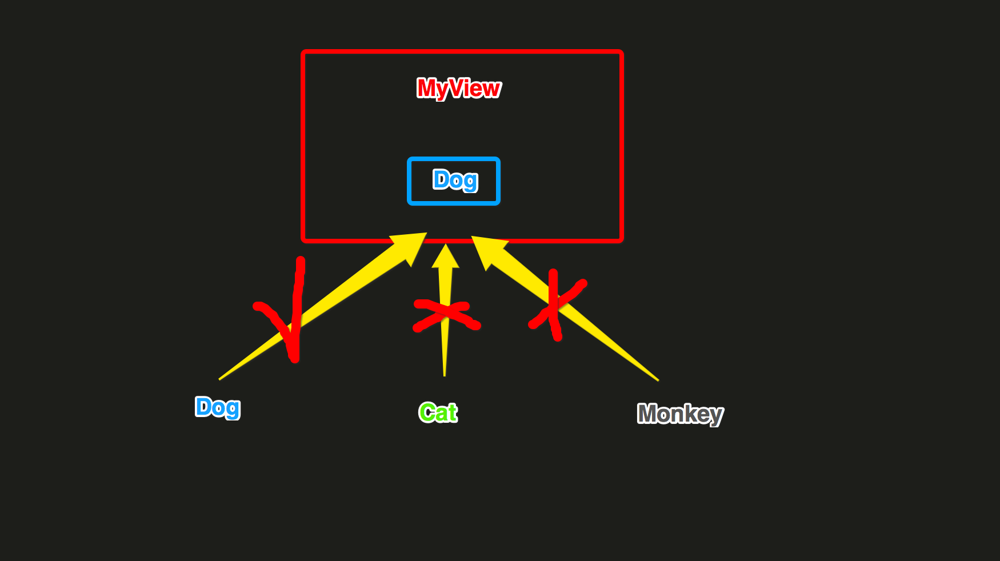
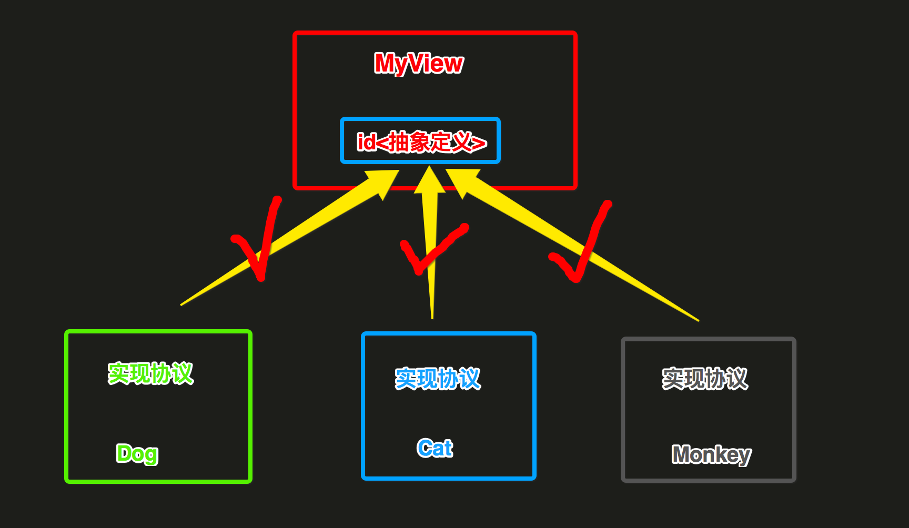
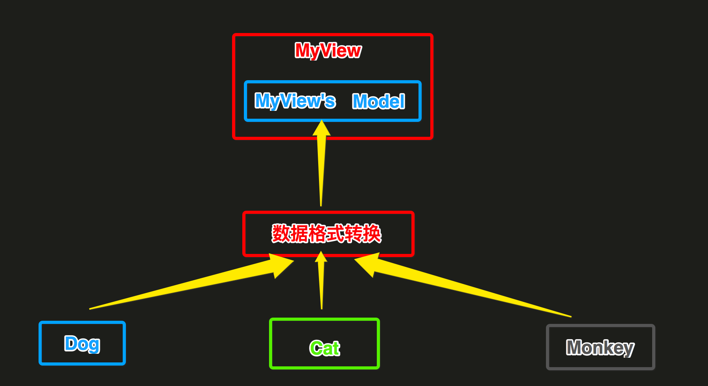

## 让一套UI代码通用

公司搞的模块化开发，但是然并卵。每一个子模块需要的UI，可能与主App或其他模块的UI基本大体一致，但是不能直接拿出来复用。跳槽了几个公司，我发现都是直接耦合的，一些效果很炫的UI几乎不能重用，硬生生的拿过来修修补补，改名字、改前缀....

因为他们的UI代码中有如下的一些硬依赖：

- (1) 耦合可能过多的业务逻辑处理，不是一个纯粹的用来效果展示的UI

- (2) 内部耦合的一些跟网络请求response数据相关的实体类，而这些实体类又耦合了其他的业务代码

那么，想让一套UI通用，随便将几个.h与.m拖到某个工程，就可以立刻编译通过，运行，设置样式，进行效果展示，就必须解决上面的几个耦合问题。

#### 第一个问题、UI耦合业务代码、网络请求处理...

我们应该仅仅让UI只是负责接收数据，进行显示，然后当触发触摸事件，简单的通知外界（delegate或block），只是告诉外界发生事件的位置（NSIndexpath、CGPoint..），而不应该将UI显示的数据回传给外界，而是让外界自行对触发事件的位置，计算得到真实数据，自己进行处理。

#### 第二个问题、耦合了一些具体的response data 实体类

虽然UI是必须对一个model进行数据显示，但是一旦耦合某一个具体类，那么这个UI就只能够为这一个实体类进行数据显示了，那么就是下面这种情况了：




对于其他的具体类Cat、Monkey的对象，几乎不能用了。

有两种改进的方法：

- (1) 通过抽象协议隔离
- (2) 通过一个UIView内部依赖的具体类隔离

个人觉得吧，(1)的方案是最好的，完全隔离开了，但是有点麻烦，需要让其他类型去实现这个协议里面的所有的数据转换方法。这种情况下的结构是这样的：



我是觉得(2)比较简单实用，尤其在后台接口没有定的情况下，直接通过定好UIView内部自己依赖的具体类，进行数据的显示效果调试、编码。这种情况下的结构是这样的：



我觉得(2)比较实用，尤其是没有response数据结构的时候，我就根据UI原型设计构造View内部依赖的Mode即可开始写UI了。

等到response结构出来了，我就只是需要将response结构转换成View内部依赖的Model即可，UI内部的显示逻辑不需要做任何的修改。


#### 下面是在写功能模块时候的一些片段代码示例

首先是View的定义、View的数据源、View产生时间的回调delegate、模仿UITableView。

```objc
@protocol NVMRetailSpecificationViewDataSource <NSObject>
@optional
- (NVMRetailSpecificationModel*)specificationModel;
@end

@protocol NVMRetailSpecificationViewDelegate <NSObject>
@optional
- (NSAttributedString *)specificationValueForSelectedIndexPaths:(NSArray *)indexpaths;
- (NSAttributedString *)specificationDidClickDoneForSelectedIndexPaths:(NSArray *)indexpaths;
@end

@interface NVMRetailSpecificationsView : UIView

//1.
- (instancetype)initWithFrame:(CGRect)frame
                    datSource:(id<NVMRetailSpecificationViewDataSource>)dataSource
                     delegate:(id<NVMRetailSpecificationViewDelegate>)delegate;

//2.
- (void)reloadData;

@end
```

View内部只是依赖自定义的Model进行数据显示

```objc
@implementation NVMRetailSpecificationsView

......

- (void)reloadData {
    if (_dataSource && [_dataSource respondsToSelector:@selector(specificationModel)]) {
        
        // 获取数据源
        _model = [_dataSource specificationModel];
        
        // 设置顶部标题
        self.topTitleLabel.text = _model.topTitle;

        // 找出每一个row中默认选中的item
        for (int i = 0; i < _model.sections.count; i++) {
            NVMRetailSpecificationSectionModel *section = [_model.sections objectAtIndex:i];
            NVMRetailSpecificationRowModel *row = section.row;
            for (int k = 0; k < row.items.count; k++) {
                NVMRetailSpecificationRowItemModel *item = [row.items objectAtIndex:k];
                if (item.selected) {
                    NVMRetailSpecificationRowItemCellIndexPathModel *idx = [NVMRetailSpecificationRowItemCellIndexPathModel new];
                    idx.section = i;
                    idx.row = 0;
                    idx.itemIndex = k;
                    [_curIndexPaths addObject:idx];
                }
            }
        }
        
        // 设置底部左侧价格
        if ((_curIndexPaths.count > 0) && [_delegate respondsToSelector:@selector(specificationValueForSelectedIndexPaths:)]) {
            self.bottomLeftPriceLabel.attributedText = [_delegate specificationValueForSelectedIndexPaths:_curIndexPaths];
        }
        
        // 刷新中间列表
        NVMRetailSpecificationModel *model = _model;
        dispatch_async(dispatch_get_global_queue(0, 0), ^() {
            [[NVMRetailSpecificationsItemCellFrameManager sharedInstance] computeFramesWithSpecificationModel:model];
            dispatch_async(dispatch_get_main_queue(), ^() {
                [self.middleTableView reloadData];
                [self setNeedsLayout];
            });
        });
    }
}

.....

@end
```

外界创建View的地方，构造View内部依赖数据源类型，以及完成一些View的回调函数实现

```objc
@implementation NVMRetailHomeViewController {
    NVMRetailSpecificationModel *model;
}

- (void)touchesBegan:(NSSet<UITouch *> *)touches withEvent:(UIEvent *)event {
    
    //1. 数据构造
    model = [NVMRetailSpecificationModel new];
    model.topTitle = @"坚果咳咳奶盖";
    model.bottomDonenButtonTitle = @"选好了";
    
    NSMutableArray *sections = [NSMutableArray new];
    for (int i = 0; i < 3; i++) {
        
        //sections
        NVMRetailSpecificationSectionModel *section = [NVMRetailSpecificationSectionModel new];
        section.title = [NSString stringWithFormat:@"规格%d", i + 1];
        
        //row
        NVMRetailSpecificationRowModel *row = [NVMRetailSpecificationRowModel new];
        int rowItemCount = rand()%20;
        rowItemCount = (rowItemCount > 0) ? rowItemCount : 1;
        
        //row[0].items
        NSMutableArray *rowItems = [NSMutableArray new];
        for (int k = 0; k < rowItemCount; k++) {
            NVMRetailSpecificationRowItemModel *item = [NVMRetailSpecificationRowItemModel new];
            if (k == 0) {item.selected = YES;}
            else {item.selected = NO;}
            item.text = [NSString stringWithFormat:@"子规格%d", k + 1];
            [rowItems addObject:item];
        }
        
        row.items = rowItems;
        NSLog(@"section: %d, row: %d, itemCount: %d", i, 1, rowItemCount);
        
        section.row = row;
        [sections addObject:section];
    }
    model.sections = sections;
    
    
    //2. VC创建、delegate设置
    NVMRetailSpecificationsViewController *vc = [[NVMRetailSpecificationsViewController alloc] initWithViewDatSource:self Viewdelegate:self ViewControllerDelegate:self];
    
    //3. 展示，在回调block中，返回一个最后执行确定按钮执行路径动画的CGPath
    [vc presentInNavigationController:self.navigationController
                     dissMissCallback:^CGPathRef(CGPoint doneButtonCenter) {
                         return nil;
                     }];
}

#pragma mark - NVMRetailSpecificationDataSource

- (NVMRetailSpecificationModel*)specificationModel {
    return model;
}

#pragma mark - NVMRetailSpecificationDelegate

- (NSAttributedString *)specificationValueForSelectedIndexPaths:(NSArray *)indexpaths {
    return 计算后的真实数据;
}

- (void)specificationViewDidClickDoneWithSelectedIndexPaths:(NSArray *)indexpaths {

}

- (void)specificationViewDidClickClsoe {
    
}

- (void)specificationViewDidClickBackgroud {
    
}

@end
```

这样后的UI这套代码，就是一套通用的，随便拖到哪里，只要完成数据转换部分就可以了。可能大家也都知道，只是懒得这么写...