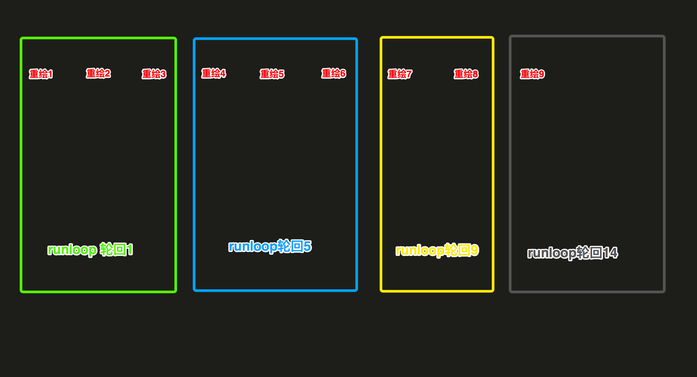

## CATransaction 打包多个Animation的事务

CATransaction也分为隐式和显式。

### 隐试

在某次RunLoop中设置了一个“Animatable”属性，如果当前没有设置事务，则会自动创建一个CATransaction，并在当前线程的**下一个RunLoop**中commit这个CATransaction。

RunLoop能够接受的事件源类型:

- (1) timers
- (2) observers
- (3) sources
	- (3.1) sources0
	- (3.2) sources1

当RunLoop处理完`当前轮`所有的上述类型的事件源，就会进入到`休眠`。等待下轮`睡醒`之后，继续处理后续添加的事件源。

### 显试

就是直接调用CATransaction的[CATransaction begin]，[CATransaction commit]等相关方法。比如我们不希望self.subLayer.position = CGPointMake(100, 100)产生动画，则可以在CATransaction中设置：

```objc
//1.
[CATransaction begin];  

//2.
[CATransaction setDisableActions:YES];//关闭动画

//3.
[CATransaction setValue:[NSNumber numberWithFloat:5.0f] forKey:kCATransactionAnimationDuration];//动画时间
self.subLayer.position = CGPointMake(100, 100);  

//4.
[CATransaction commit]; 
```

另外事务可以嵌套，当事务嵌套时候，只有最外层的事务commit了之后，整个动画才会执行。

## RunLoop 的大致结构

```
CFRunLoop = {

	//1.
	current mode = UIInitializationRunLoopMode,
	
	//2.
	common modes = [UITrackingRunLoopMode,
					kCFRunLoopDefaultMode
	],

	//3.
	common mode items = [
		CFRunLoopSource1
		CFRunLoopSource2
		CFRunLoopSource3
		....

		CFRunLoopObserver1
		CFRunLoopObserver2
		CFRunLoopObserver3
		....

		CFRunLoopTimer1
		CFRunLoopTimer2
		CFRunLoopTimer3
		.....
	],

	//4.
	modes = [
	
		//4.1 UITrackingRunLoopMode
		CFRunLoopMode <name = UITrackingRunLoopMode> = {
			sources0 = [

			],

			sources1 = [

			],

			timers = [

			],

			observers = [

			],

			currently/soft deadline in/hard deadline in
		},

		//4.2 kCFRunLoopDefaultMode
		CFRunLoopMode <name = kCFRunLoopDefaultMode> = {
			sources0 = [

			],

			sources1 = [

			],

			timers = [

			],

			observers = [

			],

			currently/soft deadline in/hard deadline in
		},

		//4.3 私有model
		CFRunLoopMode <name = UIInitializationRunLoopMode> = {
			sources0 = [

			],

			sources1 = [

			],

			timers = [

			],

			observers = [

			],

			currently/soft deadline in/hard deadline in
		},

		//4.4 私有model
		CFRunLoopMode <name = GSEventReceiveRunLoopMode> = {
			sources0 = [

			],

			sources1 = [

			],

			timers = [

			],

			observers = [

			],

			currently/soft deadline in/hard deadline in
		},
		
		//4.5 kCFRunLoopCommonModes
		CFRunLoopMode <name = kCFRunLoopCommonModes> = {
			sources0 = [

			],

			sources1 = [

			],

			timers = [

			],

			observers = [

			],

			currently/soft deadline in/hard deadline in
		},
	],
}
```

## RunLoop 的所有状态

```c
typedef CF_OPTIONS(CFOptionFlags, CFRunLoopActivity) {
    kCFRunLoopEntry         = (1UL << 0), // 即将进入Loop
    kCFRunLoopBeforeTimers  = (1UL << 1), // 即将处理 Timer
    kCFRunLoopBeforeSources = (1UL << 2), // 即将处理 Source
    kCFRunLoopBeforeWaiting = (1UL << 5), // 即将进入休眠
    kCFRunLoopAfterWaiting  = (1UL << 6), // 刚从休眠中唤醒
    kCFRunLoopExit          = (1UL << 7), // 即将退出Loop
};
```

## RunLoop 处理事件源的规则

- (1) 分成多轮执行，每一轮执行完就休眠，等待下一轮的唤醒
- (2) 当处于某一轮时，RunLoop只能处于一个mode
- (3) 只有当这一轮，当前model下的所有事件处理分发完毕，然后进入休眠
- (4) 新的一轮被唤醒后，继续处理再上一次添加的一些`未完成`的事件源，并且只能是当前mode下的事件

也就是说，RunLoop就是一圈一圈的不断的跑，跑完就休眠，再被唤醒。对当前正在执行mode下事件时，接收到的其他的事件源，将会`暂存`而并不会立刻去执行分发。

一直等待RunLoop跑下一圈时，并且是对应的mode，才会去处理`上一批次`那些`暂存`的事件源。

## CoreAnimation 注册一个 CFRunLoopObserver 到 RunLoop， 在回调时完成 CATransaction 的一些打包

> 原生的CoreAnimation动画，会在某些情况下被系统禁止掉，比如ViewController侧滑返回时，但是注册RunLoop的CADisplayLink形式的定时器动画会一直执行。

由于原生CoreAnimation在主线程RunLoop已经注册了一个CATransaction，其order为`CATransactionCommitRunLoopOrder`，看下他的order是多少:

```objc
@implementation ViewController

- (void)viewDidLoad {
    [super viewDidLoad];
    
    id runloop = [NSRunLoop currentRunLoop];
//断点 fr -v
}

@end
```

打印runloop信息太多，可参照如下结构去对应的参考:

在`UITrackingRunLoopMode`这个model下，可以从下面的`observers`下找到:

```c
<CFRunLoopObserver 0x608000120f00 [0x10cbe4df0]>{valid = Yes, activities = 0xa0, repeats = Yes, order = 2000000, callout = _ZN2CA11Transaction17observer_callbackEP19__CFRunLoopObservermPv (0x10d6ebcfe), context = <CFRunLoopObserver context 0x0>}
```


在`kCFRunLoopDefaultMode `这个model下，也可以从下面的`observers`下找到:

```c
<CFRunLoopObserver 0x608000120f00 [0x10cbe4df0]>{valid = Yes, activities = 0xa0, repeats = Yes, order = 2000000, callout = _ZN2CA11Transaction17observer_callbackEP19__CFRunLoopObservermPv (0x10d6ebcfe), context = <CFRunLoopObserver context 0x0>}
```

在`UIInitializationRunLoopMode `这个model下，也可以从下面的`observers`下找到:

```c
<CFRunLoopObserver 0x608000120f00 [0x10cbe4df0]>{valid = Yes, activities = 0xa0, repeats = Yes, order = 2000000, callout = _ZN2CA11Transaction17observer_callbackEP19__CFRunLoopObservermPv (0x10d6ebcfe), context = <CFRunLoopObserver context 0x0>}
```

从回调函数的名字中可以看出，都是包含`Transaction`，所以应该就是负责注册`CATransaction`到RunLoop的回调函数，而且他们的order都是`2000000`。

## CATransaction 干什么的

一般情况下写一个Label，显示文字如下:

```objc
UILabel* label = [[UILabel alloc]initWithFrame:CGRectMake(10, 50, 300, 14)];
label.backgroundColor = [UIColor whiteColor];
label.font = [UIFont systemFontOfSize:14.0f];
label.text = @"test";
[self.view addSubview:label];
```

后面显示的过程，我们都看不到了。其实还有很多的:

### 第一步、CoreAnimation关注 Main RunLoop 的如下状态改变

- (1) `kCFRunLoopBeforeWaiting` runloop即将进入休眠
- (2) `kCFRunLoopExit` runloop即将退出

这两种状态下，runloop是最`清闲`的时候，以至于不会太影响runloop当前运行的效率。

### 第二步、CFRunLoopObserver回调时，CoreAnimation 将上面的UI代码使用CATransaction事务包裹起来

```objc
//1. 开始事务
[CATransaction begin]

//2. 将UI对象的代码打包成CoreAnimation
// CoreAnimation 1
// CoreAnimation 2
// CoreAnimation 3

//3. 将CoreAnimation添加到CALayer
CALayer addAnimations:@[CoreAnimation 1, CoreAnimation 2, CoreAnimation 3]

//4. 结束事务
[CATransaction commit]
```

### 第三步、将处理好的CALayer，再扔给一个单独的渲染服务进程

有一个专门复杂渲染CALayer内部数据，成为一个图像的系统进程。

### 第四步、渲染完毕之后最后交给GPU文理处理，处理成为帧数据，最后放到帧数据缓存冲，由显示器去读取


总的来说，可以看出`CATransaction`用来将一系列的UI显示操作，打包成一个集合体。在恰当的时候，`连贯性`的显示在屏幕上。

## POPAnimation 完成 注册到 RunLoop 的定时器动画

首先关注 MainRunLoop 的 `kCFRunLoopBeforeWaiting | kCFRunLoopExit` 这两种状态，因为这两种状态是runloop最`清闲`的时候。

```objc
- (void)_scheduleProcessPendingList
{
  // see WebKit for magic numbers, eg http://trac.webkit.org/changeset/166540

  //1. CoreAnimation CATransaction runloop ordedr
  static const CFIndex CATransactionCommitRunLoopOrder = 2000000;

  //2. PopAnimation CATransaction runloop ordedr
  static const CFIndex POPAnimationApplyRunLoopOrder = CATransactionCommitRunLoopOrder - 1;

  //3.
  OSSpinLockLock(&_lock);

  //4. 
  if (!_pendingListObserver) {
    __weak POPAnimator *weakSelf = self;

    //4.1 创建一个 CFRunLoopObserver，监听 kCFRunLoopBeforeWaiting（休眠） | kCFRunLoopExit (退出)
    _pendingListObserver = CFRunLoopObserverCreateWithHandler(kCFAllocatorDefault, kCFRunLoopBeforeWaiting | kCFRunLoopExit, false, POPAnimationApplyRunLoopOrder, ^(CFRunLoopObserverRef observer, CFRunLoopActivity activity) {

        // 4.1.1 runloop状态改变回调函数中，读取帧动画
        [weakSelf _processPendingList];
    });

    //4.2 将observer 添加到 runloop
    if (_pendingListObserver) {
      CFRunLoopAddObserver(CFRunLoopGetMain(), _pendingListObserver,  kCFRunLoopCommonModes);
    }
  }

  //5. unlock
  OSSpinLockUnlock(&_lock);
}
```

然后runloop状态改变回调函数`_processPendingList`读取`_staticStates[]`数组中的每一个动画

```c
static POPStaticAnimatablePropertyState _staticStates[] =
{
	{背景色改变},
	{放大},
	{缩小},
	{位移},
	......
}
```

## YYTransaction

将多个UI内容绘制操作，先暂时组织到一个Group集合中，然后在RunLoop最`清闲`的时候依次去通知执行重绘。


## YYTransaction解析一、一个YYTransaction对象，就是用来打包，某一个具体的绘制操作

修改UI对象的某一个属性，都会触发重新绘制的操作

```objc
@interface XZHLabel : UIView
@property (nonatomic, copy) NSString *text;
@property (nonatomic, strong) UIFont *font;
@end
@implementation XZHLabel

- (void)setText:(NSString *)text {
    _text = text.copy;
    [[YYTransaction transactionWithTarget:self selector:@selector(contentsNeedUpdated1)] commit];
}

- (void)setFont:(UIFont *)font {
    _font = font;
    [[YYTransaction transactionWithTarget:self selector:@selector(contentsNeedUpdated2)] commit];
}

- (void)layoutSubviews {
    [super layoutSubviews];
    [[YYTransaction transactionWithTarget:self selector:@selector(contentsNeedUpdated3)] commit];
}

- (void)contentsNeedUpdated1 {
    [self.layer setNeedsDisplay];
}

- (void)contentsNeedUpdated2 {
    [self.layer setNeedsDisplay];
}

- (void)contentsNeedUpdated3 {
    [self.layer setNeedsDisplay];
}

....

@end
```

YYTransaction组装UI对象，以及触发执行重绘时的回调函数的SEL：

```objc
@implementation YYTransaction

+ (YYTransaction *)transactionWithTarget:(id)target selector:(SEL)selector{
    if (!target || !selector) return nil;
    
    //1.
    YYTransaction *t = [YYTransaction new];
    
    //2.
    t.target = target;
    
    //3.
    t.selector = selector;
    
    return t;
}

@end
```

YYTransaction对象commit之后，添加到一个Set暂时保存:

```objc
@implementation YYTransaction

- (void)commit {
    
    //1.
    if (!_target || !_selector) return;
    
    //2. 创建 transactionSet，关注runloop状态改变
    YYTransactionSetup();
    
    //3. Set暂时保存YYTransaction对象
    [transactionSet addObject:self];
}

@end
```

可以看到对:

- (1) 绘制内容改变
- (2) 对Font的改变
- (3) 对frame的改变

这三个UI对象的操作，都会触发一次重绘操作，且分别使用`YYTransaction`来打包起来，最终保存到一个Set集合中。

### YYTransaction三、重写`hash`、`isEqual:`，对相同属性值的不同对象的hash都是相同的，在添加到set集合时，就不会重复添加

```objc
- (void)testHash {
    
    YYTransaction *t1 = [YYTransaction transactionWithTarget:self selector:@selector(haha)];
    YYTransaction *t2 = [YYTransaction transactionWithTarget:self selector:@selector(haha)];
    YYTransaction *t3 = [YYTransaction transactionWithTarget:self selector:@selector(haha)];
    YYTransaction *t4 = [YYTransaction transactionWithTarget:self selector:@selector(haha)];
    
    NSLog(@"t1.hash = %ld", t1.hash);
    NSLog(@"t2.hash = %ld", t2.hash);
    NSLog(@"t3.hash = %ld", t3.hash);
    NSLog(@"t4.hash = %ld", t4.hash);
    
    NSMutableArray *array = [NSMutableArray new];
    [array addObject:t1];
    [array addObject:t2];
    [array addObject:t3];
    [array addObject:t4];
    NSLog(@"array = %@", array);
    
    NSMutableSet *set = [NSMutableSet new];
    [set addObject:t1];
    [set addObject:t2];
    [set addObject:t3];
    [set addObject:t4];
    NSLog(@"set = %@", set);

}
```

输出如下

```
2017-03-08 21:58:10.131 yyAsyncLayerDemo[1714:24749] t1.hash = 140276078322742
2017-03-08 21:58:10.131 yyAsyncLayerDemo[1714:24749] t2.hash = 140276078322742
2017-03-08 21:58:10.131 yyAsyncLayerDemo[1714:24749] t3.hash = 140276078322742
2017-03-08 21:58:10.131 yyAsyncLayerDemo[1714:24749] t4.hash = 140276078322742

2017-03-08 21:58:10.132 yyAsyncLayerDemo[1714:24749] array = (
    "<YYTransaction: 0x7f95934a1000>",
    "<YYTransaction: 0x7f95934a1040>",
    "<YYTransaction: 0x7f95934a1060>",
    "<YYTransaction: 0x7f95934a0c00>"
)

2017-03-08 21:58:10.132 yyAsyncLayerDemo[1714:24749] set = {(
    <YYTransaction: 0x7f95934a1000>
)}
```

可以看到对于`Set`类型的集合，对于相同hash值的对象，只会添加一次。所以，这样也就避免了，对同样数据进行重复性的渲染。

尝试如果不重写`hash`、`isEqual:`的结果:

```objc
- (void)testHash2 {
    
    YYTransaction *t1 = [YYTransaction transactionWithTarget:self selector:@selector(haha)];
    YYTransaction *t2 = [YYTransaction transactionWithTarget:self selector:@selector(haha)];
    YYTransaction *t3 = [YYTransaction transactionWithTarget:self selector:@selector(haha)];
    YYTransaction *t4 = [YYTransaction transactionWithTarget:self selector:@selector(haha)];
    
    NSLog(@"t1.hash = %ld", t1.hash);
    NSLog(@"t2.hash = %ld", t2.hash);
    NSLog(@"t3.hash = %ld", t3.hash);
    NSLog(@"t4.hash = %ld", t4.hash);
    
    NSMutableSet *set = [NSMutableSet new];
    [set addObject:t1];
    [set addObject:t2];
    [set addObject:t3];
    [set addObject:t4];
    NSLog(@"set = %@", set);
}
```

输出如下

```
2017-03-08 22:02:57.545 yyAsyncLayerDemo[1752:27860] t1.hash = 140729711184320
2017-03-08 22:02:57.545 yyAsyncLayerDemo[1752:27860] t2.hash = 140729711138400
2017-03-08 22:02:57.545 yyAsyncLayerDemo[1752:27860] t3.hash = 140729711288848
2017-03-08 22:02:57.545 yyAsyncLayerDemo[1752:27860] t4.hash = 140729711296800

2017-03-08 22:02:57.546 yyAsyncLayerDemo[1752:27860] set = {(
    <YYTransaction: 0x7ffe3071c9c0>,
    <YYTransaction: 0x7ffe30736210>,
    <YYTransaction: 0x7ffe30738120>,
    <YYTransaction: 0x7ffe30711660>
)}
```

可以看到，系统的hash实现，得到的hash值是`不一样`的。那么，如果按照这样，那下面的这一段重复性修改为同一样的文字的代码：

```c
- (void)viewDidLoad {
    [super viewDidLoad];

	//1.
    _label = [[XZHLabel alloc] initWithFrame:CGRectMake(10,
                                                        100,
                                                        300,
                                                        300)];
    //2.
    [self.view addSubview:_label];
    
    //3.
    for (int i = 0; i < 10000; i++) {
        _label.text = [NSString stringWithFormat:@"我日你吗啊  %d", i+1];
    }
}

@end
```

实际上就是重复性对同一段文字进行了`10000`次绘制。而重写了`hash`、`isEqual:`之后，则只会进行`1`次绘制，其余的对`UI对象相同属性的`绘制操作，直接就给过`滤掉`了。

比如上，都是对`text`属性文本值进行修改的绘制，对于这一类的绘制只会`保存一次`操作。

而最后调用绘制方法时，绘制的就是最后一次设置`text == 我日你吗啊 100`。

这样就避免了前面`9999`次对`text`的无畏的绘制，因为前面`9999`次的文本绘制，都会被后面绘制的内容`覆盖掉`，那还不如不进行绘制。


### YYTransaction解析三、`dispatch_once`执行关注MainRunLoop的`kCFRunLoopBeforeWaiting | kCFRunLoopExit`状态，以及回调中将当前runloop轮回时，Set中包含的YYTransaction对象，全部遍历通知进行重绘

监听runloop的`kCFRunLoopBeforeWaiting | kCFRunLoopExit`这两个状态，因为这两个状态是runloop最`空闲`的循环时刻

```c
static void YYTransactionSetup() {
    static dispatch_once_t onceToken;
    dispatch_once(&onceToken, ^{
        
        //1. 初始化 transactionSet
        transactionSet = [NSMutableSet new];
        
        //2. Main RunLoop
        CFRunLoopRef runloop = CFRunLoopGetMain();
        
        //3. Create RunLoop Observer
        CFRunLoopObserverRef observer;
        observer = CFRunLoopObserverCreate(CFAllocatorGetDefault(),
                                           kCFRunLoopBeforeWaiting | kCFRunLoopExit,
                                           true,      // repeat
                                           0xFFFFFF,  // after CATransaction(2000000)
                                           YYRunLoopObserverCallBack, NULL);
        
        //4. Add Observer to RunLoop
        CFRunLoopAddObserver(runloop, observer, kCFRunLoopCommonModes);
        CFRelease(observer);
    });
}
```

runloop状态改变为`kCFRunLoopBeforeWaiting | kCFRunLoopExit`时的回调

```c
static NSMutableSet *transactionSet = nil;

static void YYRunLoopObserverCallBack(CFRunLoopObserverRef observer,
                                      CFRunLoopActivity activity,
                                      void *info)
{
    //1. 如果当前runloop轮回的set没有transaction，直接结束
    if (transactionSet.count == 0) return;
    
    //2. 当前runloop轮回，需要执行的transaction
    NSSet *currentSet = transactionSet;
    
    //3. 将上面将要执行的transaction，从当前runloop轮回的set中清除
    // 以备用来接收下一轮runloop时，要进行的transaction
    transactionSet = [NSMutableSet new];
    
    //4. 便利当前runloop轮回下，所有的transaction去执行
    [currentSet enumerateObjectsUsingBlock:^(YYTransaction *transaction, BOOL *stop) {
#pragma clang diagnostic push
#pragma clang diagnostic ignored "-Warc-performSelector-leaks"
        // 通知UI对象执行重新绘制
        [transaction.target performSelector:transaction.selector];
#pragma clang diagnostic pop
    }];
}
```

上面这一点很重要，将多个YYTransaction，按照runloop不同的轮回，进行切割，分批次的执行。

假设，如果UI有很多个需要重绘的操作：

```objc
- (void)viewDidLoad {
    [super viewDidLoad];

    _label = [[XZHLabel alloc] initWithFrame:CGRectMake(10,
                                                        100,
                                                        300,
                                                        300)];
    
    [self.view addSubview:_label];
    
    // 重复绘制10000次
    for (int i = 0; i < 10000; i++) {
        _label.text = [NSString stringWithFormat:@"我日你吗啊 %ld", i+1];
    }
}
```

重复进行`10000次`的文本内容的绘制，试想如果在一个runloop轮回，马上全部执行完，肯定造成一定的卡顿。

> runloop并不会一直执行，而是执行完一个轮回就会休息一会，然后再开始新一轮的工作。也就是说，runloop每一个轮回，只会处理一部分的事件。


那么对于`-[YYTransaction commit]`， 就是将当前YYTransaction对象，添加到`当前RunLoop轮回时`的transactionSet集合中

```objc
@implementation YYTransaction

- (void)commit {
    
    //1.
    if (!_target || !_selector) return;
    
    //2. 创建 transactionSet，关注runloop状态改变
    YYTransactionSetup();
    
    //3. 添加到`当前RunLoop轮回时`的transactionSet集合中
    [transactionSet addObject:self];
}

@end
```

而对于RunLoop每一轮回，状态改变为`kCFRunLoopBeforeWaiting | kCFRunLoopExit`时，则会从当前`transactionSet`集合中，取出所有的YYTransaction对象，全部通知进行重绘操作:

```c
static void YYRunLoopObserverCallBack(CFRunLoopObserverRef observer,
                                      CFRunLoopActivity activity,
                                      void *info)
{
    //1. 如果当前runloop轮回的set没有transaction，直接结束
    if (transactionSet.count == 0) return;
    
    //2. 当前runloop轮回，需要执行的transaction
    NSSet *currentSet = transactionSet;
    
    //3. 将上面将要执行的transaction，从当前runloop轮回的set中清除
    // 以备用来接收下一轮runloop时，要进行的transaction
    transactionSet = [NSMutableSet new];
    
    //4. 便利当前runloop轮回下，所有的transaction去执行
    [currentSet enumerateObjectsUsingBlock:^(YYTransaction *transaction, BOOL *stop) {
#pragma clang diagnostic push
#pragma clang diagnostic ignored "-Warc-performSelector-leaks"
        // 通知UI对象执行重新绘制
        [transaction.target performSelector:transaction.selector];
#pragma clang diagnostic pop
    }];
}
```

而当这一轮runloop循环执行完毕，runloop进入`休息`，而此时`transactionSet`集合也几经被清空。

而当下一个`-[YYTransaction commit]`操作，又将YYTransaction对象保存到此时的`transactionSet`集合中。

而runloop又被`唤醒`，一直到runloop再次进入到`kCFRunLoopBeforeWaiting | kCFRunLoopExit`时，又开始处理此时`transactionSet`下的所有的YYTransaction对象。


大致的按照runloop轮回切割重绘操作的流程图如下:




也就是将大量的重绘操作，分批次进行。


## YYAsyncLayer解析一、重写`-[CALayer defaultValueForKey:]`来返回一些key的默认值

```objc
+ (id)defaultValueForKey:(NSString *)key {
    if ([key isEqualToString:@"displaysAsynchronously"]) {
        return @(YES);
    } else {
        return [super defaultValueForKey:key];
    }
}
```

## YYAsyncLayer解析二、`-[CALayer setNeedsDisplay]`、`-[CALayer display]`

### setNeedsDisplay

当调用`-[UIView setNeedsDisplay]`时，UIKit会调用这个view的`layer`的`setNeedsDisplay`方法。

这个设置一个标记，表明这个层已经脏了（dirty，被`修改`了），实际上并没有做任何事情。所以，调用多次-setNeedsDisplay 没有任何问题。


### display

当渲染系统准备好后，会调用`-[CALayer display]`方法。这时，CALayer会设置缓存。然后设置缓存的Core Graphics的上下文环境（CGContextRef）。后面的绘制会通过这个CGContextRef绘制到缓存中。

这个时机时，已经开始进行绘制内容了。


## YYAsyncLayer解析三、使用计算器累加，并判断计数器的变化，来代替判断是否后续执行了`-[CALayer setNeedsDisplay]`，来取消正准备执行的异步绘制任务

### 当执行`-[CALayer setNeedsDisplay]`时

```objc
- (void)setNeedsDisplay {

    //1. 累加计算器
    [_sentinel increase];
    
    //2. 通知系统进行layer渲染，即异步调用 -[CALayer display]
    [super setNeedsDisplay];
}
```

计数器+1，并通知系统准备调用`-[CALayer display]`。

### 当执行`-[CALayer display]`时

```objc
- (void)display {
    
    //1.
    super.contents = super.contents;
    
    //2. 开始进入绘图的逻辑
    [self _displayAsync:_displaysAsynchronously];
}
```

调用了一个私有函数，进入绘制

```objc
- (void)_displayAsync:(BOOL)async {

	.........
	
	//1. 首先取出此时计数器的值
	YYSentinel *sentinel = _sentinel;//这里使用局部指针，防止后面的isCancelled这个block对self循环引用
	int32_t value = sentinel.value;
	
	//2. 并让block持有现在的计数器值（拷贝值），
	//如果后续执行了-[CALayer setNeedsDisplay]，那么最新的sentinel.value，肯定不等于之前block捕获的拷贝值
	BOOL (^isCancelled)() = ^BOOL() {
            	return value != sentinel.value;//block持有的是YYSentinel对象，而不是当前Layer对象
			};
			
	//3. 异步线程完成所有的绘制操作
	dispatch_async(YYAsyncLayerGetDisplayQueue(), ^{
		
		//3.1 看后面是否有再执行过 -[CALayer setNeedsDisplay]，
	    if (isCancelled()) {
	        CGColorRelease(backgroundColor);
	        return;
	    }
	    
	    .....绘制任务......
	    
	});
	
	........
	
}
```

## YYAsyncLayer解析三、通过block包裹值，得到不仅仅是某一个时刻的值，而是一个实时的值，让外界随时知道当前是否已经取消进行绘制

```c
@implemtation B  {
	Counter _counter;
}

- (^BOOL(^)(void))asyncDraw {

	//1. 首先取出对象的属性值，这一个时刻的值
	int value = _count.value;
	
	//2. block捕获的objc对象
	Counter counter = _counter;

	//3. 构造block捕获拷贝值与objc对象
	BOOL (^isCanceld)(void) = ^() {
		return (value != counter.value);
	};
	
	//4. 开始异步绘制代码
	//...........................
	// if (NO == isCanceld()) {
		结束此次绘制;
	}
}

@end

@implemtation A {
	B _b;
}

- (void)start {
	
	//1. 
	^BOOL(^isCancled)(void) = [_b asyncDraw];
	
	//2.
	if (NO == isCancled()) {
		表示B已经停止绘制
	}
}

@end
```